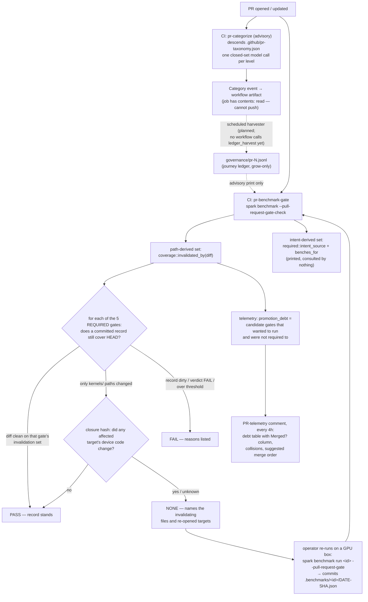
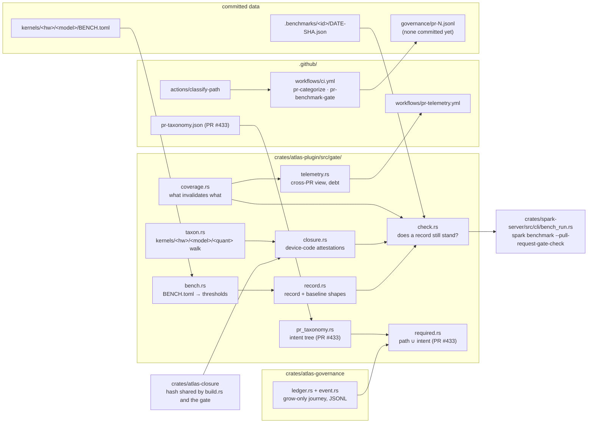
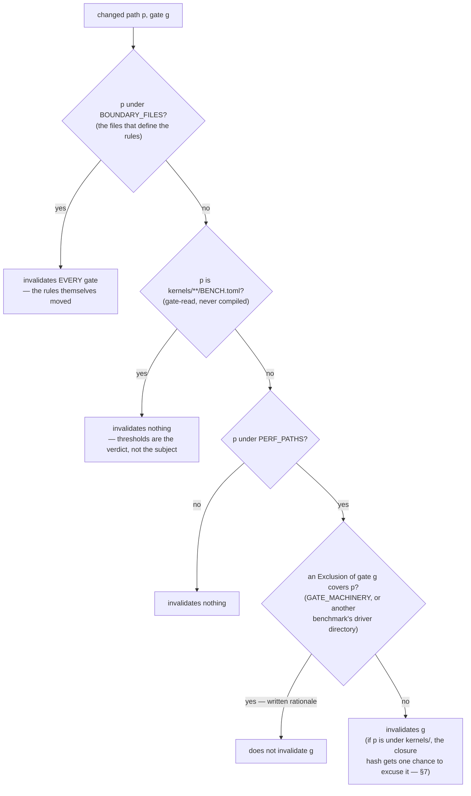
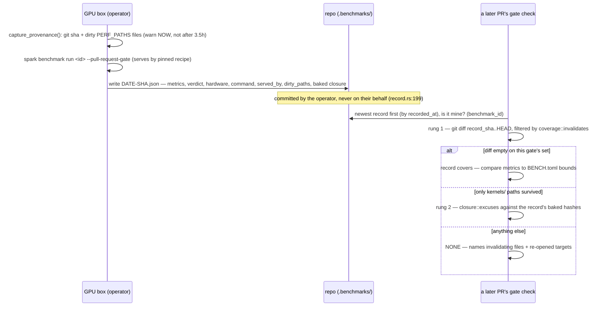
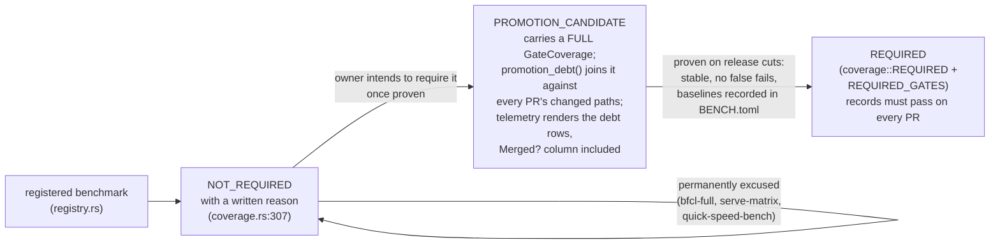

# The AI-Repository Harness

How Atlas decides which expensive GPU benchmarks a pull request must pass,
proves that the recorded results came from the code they claim to describe,
and keeps the remaining coverage debt visible instead of letting it become an
assumption.

This document is written for two readers at once: a human contributor who
wants to understand why their PR is (or is not) being asked for a 3.5-hour
GPU run, and an agent that needs exact file references to act on. Each
section leads with the plain-language version, then the mechanics.

Every load-bearing claim cites `path:line`. Line numbers were taken at the
tip of the `feat/pr-benchmark-campaign` branch (PR #433, commit `0ff3d56d4`);
symbol names are the stable reference, line numbers will drift.

> **Provenance of this document.** The harness landed in stages. The
> path-derived machinery — coverage, closure hashing, records, the gate
> check, telemetry — is merged to `main` (PRs #389, #420, #423, #428). The
> intent half — the taxonomy, the classifier descent, `required.rs`, the
> ledger writers and the harvester — is in flight in **PR #433** at the time
> of writing and is documented here from that branch. The
> [status table](#component-status) says which is which. Where an accepted
> ADR and newer code disagree, both are quoted and the disagreement is named.

---

## Table of contents

1. [The problem, in one paragraph](#the-problem)
2. [End-to-end flow](#end-to-end-flow)
3. [Component map](#component-map)
4. [Component status: merged vs in flight](#component-status)
5. [The benchmark registry](#the-benchmark-registry)
6. [The required set and the coverage policy](#coverage)
7. [Closure hashing: excusing kernel edits that change nothing](#closure-hashing)
8. [Gate records: the committed evidence](#gate-records)
9. [The gate check](#the-gate-check)
10. [The intent half: taxonomy, classifier, union](#the-intent-half)
11. [The journey ledger](#the-journey-ledger)
12. [Telemetry: the cross-PR view and the debt table](#telemetry)
13. [The promotion ladder](#the-promotion-ladder)
14. [Unfinished work and open questions](#unfinished-work-and-open-questions)

---

<a name="the-problem"></a>
## 1. The problem, in one paragraph

Atlas's correctness and performance gates run on real GPUs and cost real
time — the two BFCL accuracy legs are ~3.5 GPU-hours *each*
(`crates/atlas-plugin/src/benchmarks/bfcl/descriptors.rs:34`). CI cannot run
them per-push, so the results are measured on a GPU box, committed to the
repo as JSON records under `.benchmarks/`, and a fast, GPU-free check decides
on every PR whether those committed records still speak for the current
commit. Everything in this document exists to make three things true at
once:

1. **A PR owes exactly the gates its change can affect** — no more (GPU is
   expensive; a gate people route around is worse than a slower one) and no
   less (a missed regression is worse than either).
2. **A record is believed only when it provably describes the code** — the
   commit, the binary, and the serve configuration it claims.
3. **Whatever the gates cannot see is written down as debt**, because
   "ungated" silently read as "unaffected" is how coverage gaps become
   invisible.

The design has one recurring asymmetry, stated in
`crates/atlas-plugin/src/gate/mod.rs:81`: **over-broad costs a re-run;
under-broad is a lie.** Every ambiguous case in the harness resolves toward
re-running.

<a name="end-to-end-flow"></a>
## 2. End-to-end flow



The dashed edges are the parts that exist as code but are not yet closed
loops — see [Unfinished work](#unfinished-work-and-open-questions).

<a name="component-map"></a>
## 3. Component map



Ownership, one line each:

| Responsibility | Owner |
|---|---|
| Which paths invalidate which gate | `crates/atlas-plugin/src/gate/coverage.rs` |
| Which kernel targets a path reaches | `crates/atlas-plugin/src/gate/taxon.rs` |
| Whether device code actually changed | `crates/atlas-plugin/src/gate/closure.rs` + `crates/atlas-closure` |
| Record and threshold schemas | `crates/atlas-plugin/src/gate/record.rs`, `gate/bench.rs` |
| The verdict | `crates/atlas-plugin/src/gate/check.rs` |
| The CLI entry point | `crates/spark-server/src/cli/bench_run.rs` (`gate_check_cmd`) |
| The intent taxonomy and its rules | `.github/pr-taxonomy.json`, `gate/pr_taxonomy.rs` |
| The union a PR owes | `gate/required.rs` |
| The classifier plumbing | `.github/actions/classify-path`, `ci.yml` `pr-categorize` |
| The journey ledger | `crates/atlas-governance` |
| Artifact → ledger validation | `crates/atlas-plugin/src/bin/ledger_harvest.rs` |
| The cross-PR/debt view | `gate/telemetry.rs`, `bin/pr_telemetry.rs`, `.github/workflows/pr-telemetry.yml` |
| Benchmark registration | `crates/atlas-plugin/src/registry.rs` |

<a name="component-status"></a>
## 4. Component status: merged vs in flight

Verified by diffing `origin/main` (654411f96) against
`feat/pr-benchmark-campaign` (PR #433).

| Component | On `main` | In PR #433 only |
|---|---|---|
| `coverage.rs` floor (`PERF_PATHS`, `GATE_MACHINERY`, per-driver excludes) | yes | — |
| `BOUNDARY_FILES` | 5 entries | grows to 7 (`required.rs`, `.github/pr-taxonomy.json`) |
| `closure.rs`, `taxon.rs`, `atlas-closure`, ADR-0012 | yes | — |
| `check.rs` content-not-ancestry coverage, dirty-tree refusal, ADR-0013 | yes | small additions |
| `record.rs`, `bench.rs` (BENCH.toml thresholds) | yes | — |
| `atlas-governance` (events, ledger, G-set) | yes — with **zero writers** | first writer (`ledger_append` in CI) |
| Flat `pr-categorize` job + `actions/categorize` + `ai-models.json` | yes | — |
| Descending classifier (`actions/classify-path`), taxonomy, `pr_taxonomy.rs`, `required.rs`, `implied_benches`, `ledger_append`, `ledger_harvest`, ADR-0014 | no | yes |
| `NOT_REQUIRED` | 3 entries | 4 (adds `cross-contamination`) |
| `PROMOTION_CANDIDATES` + `promotion_debt` + telemetry **Merged?** column | no | yes |
| `cross-contamination` benchmark | no | yes |
| `--pull-request-gate-check --pr N` intent reporting | no | yes |

<a name="the-benchmark-registry"></a>
## 5. The benchmark registry

Every benchmark is a compile-time descriptor in one static table —
registration is a code review event, not a runtime discovery
(`crates/atlas-plugin/src/registry.rs:14`). The table is ordered cheapest
first, and `serve-matrix` is deliberately last because it is the only entry
that replaces the model the box is serving (`registry.rs:23`).

What exists today, with rough cost (each `duration_hint` is from the
descriptor; the agentic figures are from the committed gate record
`.benchmarks/agentic-webserver/2026-08-09-0fe272515f.json`, which ran
`iterations=10` in 783 s wall against a 1300 s budget):

| id | Gate status | Rough cost | What it measures |
|---|---|---|---|
| `concurrency-sweep` | **required** (promoted 2026-08-15) | ~25–90 min | aggregate throughput at C=1..128 on the pinned instrument, vs per-rung floors |
| `concurrency-sweep-dflash2` | **required** (added 2026-08-29) | ~25–90 min | the same ladder with the DFlash2 drafter armed — the only gate that exercises speculation |
| `decode-floor` | **required** (promoted 2026-08-15) | ~5–10 min | single-user server decode rate vs a committed floor |
| `ssm-state-poisoning-gate` | **required** | ~5–10 min | an identical replay must return identical bytes after accumulated SSM/prefix state |
| `vision-fidelity` | **required** (vision targets) | ~5 min | the served model sees the image it was sent, at its checkpoint's permitted resolution |
| `video-fidelity` | **required** (video targets) | ~5–15 min | the pad/sample contract on mixed-media input |
| `ttft-warm-gate` | **required** | ~3–6 min | cached-prefix TTFT vs a stored same-box baseline (median ≤3%, p90 ≤5%) |
| `ttft-cold-gate` | **required** | ~3–6 min | uncached prefill TTFT — the leg that sees a cold-load regression |
| `cross-contamination` | promotion candidate (PR #433) | ~2–5 min | concurrent requests must not change each other's output; zero tolerance |
| `agentic-webserver` | **required** (35B MoE flagship); dense 27B registered unmeasured — baselining only, no thresholds | ~5 min × 10 iterations | the flagship agentic task, scored on outcome and process |
| `bfcl-subset` | **required** | ~3.5 h | BFCL v4 single-turn, golden MLPerf draw (pinned n=995), dense 27B |
| `bfcl-subset-echolp` | **required** | ~3.5 h | BFCL v4, echolp draw (pinned n=1004), 35B MoE — the two draws are not score-comparable (`gate/mod.rs:56`) |
| `bfcl-full` | not required | ~12 h | the unsampled ~3,625-sample BFCL run |
| `serve-matrix` | not required | ~5–10 min / checkpoint | multi-checkpoint breadth survey for release notes |

The eleven **required** gates are `REQUIRED_GATES`
(`crates/atlas-plugin/src/gate/mod.rs`), derived element-by-element from
`coverage::REQUIRED` so the two lists cannot diverge. (This paragraph said
"five" and listed `concurrency-sweep` as not required until 2026-08-29; the
code had said otherwise since the 2026-08-15 promotion. If you are counting
gates, count the array, not this sentence.) Non-required entries
each carry a written reason in `coverage.rs::NOT_REQUIRED`
(`gate/coverage.rs:307`) — stated rather than implied, so "why doesn't
`bfcl-full` gate?" has a findable answer.

Thresholds do not live beside the records. They live beside the model, in
`kernels/<hw>/<model>/BENCH.toml`, assembled into a `GateBaseline` at read
time (`gate/bench.rs:1-29`, `gate/record.rs:230`). Two properties matter:

- **A guess can never go green.** A `status = "unmeasured"` entry carries no
  metrics table, and an entry with no thresholds is a hard failure, not a
  vacuous pass (`gate/check.rs:72` — "a gate with nothing to enforce has not
  been passed; it has not been defined").
- **A ratchet does not destroy its own justification.** `BENCH.toml` is
  under `kernels/` but is read by the gate and compiled by nothing, so it is
  exempted from invalidation by exact filename
  (`gate/coverage.rs:129-152`) and excluded from every closure hash
  (`gate/bench.rs:17-22`). Raising a bar therefore keeps the record that
  earned it.

<a name="coverage"></a>
## 6. The required set and the coverage policy

Plainly: the harness looks at the files a PR changes and computes, from
paths alone, which of the five gates can no longer trust their committed
records. This is the **deterministic floor** — no model, no network, no
clock is an input (`gate/coverage.rs:379-382`), which is what makes the
verdict reproducible offline and unreachable by anything a pull request can
*say*.

### The polarity: exclude, never claim

The obvious design — each benchmark claims the paths it covers — fails
open: a new module nobody claimed gates nothing. So the policy is inverted
(`gate/coverage.rs:12-23`): every path on the performance boundary
invalidates **every** gate, and the only way to subtract is an `Exclusion`
carrying a written rationale (`coverage.rs:33-42`). Forgetting costs a
re-run, never a missed regression.

The boundary is `PERF_PATHS` (`gate/coverage.rs:63`):

```
crates  kernels  Cargo.toml  Cargo.lock  vendor  jinja-templates
rust-toolchain.toml  3rdparty_patches
```

Two entries carry lessons worth knowing:

- `jinja-templates` is **runtime** input, not build input — the server loads
  the repo's template over the checkpoint's own chat template, and a
  template edit has been measured moving BFCL by +2.70 points
  (`gate/mod.rs:90-95`).
- `3rdparty_patches` closed a real bypass: `ATLAS_GDN_LIB` dlopens an AOT
  `.so` committed there, so replacing that artefact used to invalidate
  nothing while changing engine behaviour (`gate/coverage.rs:53-59`).

Deliberately *not* on the boundary: `.benchmarks/` (the records are the
verdict, not its subject), `bench/`, `scripts/`, docs
(`gate/coverage.rs:61-62`).

### The three-question decision

`coverage::invalidates` (`gate/coverage.rs:361-375`) asks, in order:



The two exclusion families:

- **`GATE_MACHINERY`** (`gate/coverage.rs:160`): the whole
  `crates/atlas-plugin/src/gate` prefix is excluded from every gate,
  because gate bookkeeping never runs a model; its correctness is covered by
  `cargo test`, which is a required check. Re-measuring BFCL because a
  comparison operator moved buys nothing.
- **`other_driver`** (`gate/coverage.rs:175`): each benchmark's driver
  directory is excluded from the *other* gates — the BFCL driver cannot
  change what a first-token-latency probe measures. This holds only while
  drivers do not import each other, and `coverage_map_tests` asserts that
  absence so a future cross-import fails a test instead of silently
  falsifying an exclusion (`coverage.rs:171-174`).

### The lock and its key: `BOUNDARY_FILES`

An exclusion table that could exempt the file it lives in is a lock whose
key is kept inside it: a PR could add "exclude everything" and that very
edit would trigger no gate (`gate/coverage.rs:26-31`). So the files that
*decide a verdict* invalidate everything unconditionally, and a test asserts
they appear in no exclusion set.

This list started with one entry and that was not enough. **PR #420 is the
cautionary tale** (`gate/coverage.rs:79-91`): it rewrote `record_covers` —
verdict-deciding logic — inside the `GATE_MACHINERY`-excluded directory, so
the gate listed only an unrelated kernels file as invalidating and "read red
purely by accident". The key had just been moved one room over. The list is
now seven files: `coverage.rs`, `required.rs`, `.github/pr-taxonomy.json`,
`check.rs`, `closure.rs`, `taxon.rs`, `bench.rs`
(`gate/coverage.rs:93-124`).

The taxonomy entry deserves its own sentence, because it is the one place
where the harness deliberately chose to be expensive. `.github/pr-taxonomy.json`
lives *outside* `PERF_PATHS` entirely, so before this entry, deleting every
`_benches` line in it invalidated nothing at all. Now **a taxonomy edit
re-opens all five gates — roughly 4h19m of GPU** — and the comment says why
(`gate/coverage.rs:108-111`): *"a cheap edit that quietly weakens the gate
is worse than an expensive one that cannot."* You will see this fire in the
real gate-check output in §9.

Path matching is component-wise, never a bare `starts_with` —
`Cargo.toml.orig` must not match `Cargo.toml`, because false invalidation
"trains people to distrust the gate — the failure mode that ends with
someone disabling it" (`gate/coverage.rs:329-341`).

<a name="closure-hashing"></a>
## 7. Closure hashing: excusing kernel edits that change nothing

Plainly: `kernels/gb10/common/` holds ~160 shared `.cu` files that all 22+
GB10 targets inherit. Under the path rule alone, one shared-kernel edit
re-opens every gate for every model — most of a day of fleet time
(ADR-0012). The closure hash is "rung 0" of a finer answer: if the affected
targets still compile to byte-identical device code, the old records still
stand. It can only ever *narrow* the path floor, never widen it, and only
for paths inside `kernels/` (`gate/closure.rs:3-9`).

### The taxonomy of targets

`gate/taxon.rs` walks `kernels/<hardware>/<model>/<quant>/` — a hardware dir
is one holding `HARDWARE.toml`, a model dir one holding `MODEL.toml` (which
is what excludes `common/`), and every subdir of a model is a quant
(`taxon.rs:84-107`). It deliberately duplicates
`atlas-kernels/build.rs::resolve_targets()` — build-script code is not
linkable, and a gate that needs a CUDA toolchain to enumerate targets cannot
run in CI — with a cross-check test so "disagreement is a lie, not a
discrepancy" (`taxon.rs:5-10`).

Source resolution mirrors the build's shadowing rule: `common/` is the base
layer, the model's quant dir overrides by file *stem* (`taxon.rs:109-146`).
A path under `common/` affects every target on that hardware; a path under a
model dir affects that model's targets alone (`taxon.rs:199-216`). Every
fallible step resolves to "affected": an empty source set is a resolution
failure, never a target with no kernels, because the hash of an empty set is
one constant shared by every broken target (`taxon.rs:12-18,140-144`).

### What the hash covers, and why it is not a file-set hash

ADR-0012 (`docs/adr/0012-closure-hash-cascade.md`) records why the obvious
"hash the resolved file set" design is wrong twice over: eight shadow files
*textually `#include`* the common file they shadow (so a set hash calls them
immune while the edited bytes compile straight into their kernel — silent
and fail-open), and headers are in no file set at all. So the hash covers
the **transitive quoted-`#include` closure** of each target's resolved
sources, plus `HARDWARE.toml`/`MODEL.toml`/`KERNEL.toml`, nvcc flags, arch,
and compiler version (`gate/closure.rs:60-68`, `taxon.rs:152-165`). One
crate — `crates/atlas-closure` — computes it for both the build script and
the gate, because two implementations of one hash drift, and drift is
indistinguishable from a real change (ADR-0012, consequences).

### Two-sided attestation

A record does **not** attest from the working tree. It carries the closure
values *baked into the measuring binary* (`atlas_kernels::TARGET_CLOSURES`,
attached via `GateRecord::with_closure`, `gate/record.rs:346-359`) — because
the tree and the binary differ exactly when it matters: a stale `target/`, a
dirty tree, an image carried between boxes (`gate/closure.rs:74-86`). The
check side then recomputes from the current tree using **the record's own
stored non-source inputs** (arch, compiler, flags), so the only thing that
can move the hash is the sources themselves — not the toolchain of whatever
machine runs CI (`gate/closure.rs:13-23,60-68`).

### Fail-closed, enumerated

`closure::excuses` (`gate/closure.rs:118-144`) answers "does an unchanged
closure excuse every one of these paths?" and resolves every uncertainty to
*no*: a pre-attestation record, a target the record does not mention, a path
outside `kernels/`, sources that will not resolve, an unresolvable include,
any I/O error, an empty affected set. "The cost of a false 'not excused' is
a re-run. The cost of a false 'excused' is a shipped regression with a green
gate" (`closure.rs:34-35`). The honest complement, `changed_targets`
(`closure.rs:152`), names *which* targets re-opened the gate — unknown is
reported as changed, never omitted — and that is what turns "a kernel
changed" into "this is why you owe a 3.5-hour run" in the check's output
(`gate/check.rs:371-384`).

One measured retreat is worth knowing: an unresolvable `#include` was
originally *fatal* to attestation, and that rule denied an attestation to
exactly one target — `gb10/qwen3.6-27b/nvfp4`, the MLPerf flagship, the
3.5-GPU-hour target the scheme exists to spare — because of two dead
`#if` arms naming files that exist nowhere in the repo. A safety rule that
switches itself off exactly where the cost is highest is not buying safety;
unresolvable includes are now hashed by name with a build warning
(ADR-0012, "Worse").

<a name="gate-records"></a>
## 8. Gate records: the committed evidence

Plainly: a gate run's result is a JSON file committed to the repo at
`.benchmarks/<id>/<YYYY-MM-DD>-<sha>.json`, so "did this branch pass its
benchmarks?" is answerable from the branch itself — by a human reading the
diff and by CI (`gate/mod.rs:3-21`). A second run of the same commit on the
same UTC day replaces the file: the record is the branch's *current word*,
not a log of attempts (`gate/record.rs:192-196`).

### The schema

From `GateRecord` (`gate/record.rs:19-84`) and a real committed record
(`.benchmarks/bfcl-subset/2026-08-09-8b7de2638d.json`):

| Field | What it is, and why it exists |
|---|---|
| `benchmark_id`, `benchmark_name` | which gate. The id is read back at check time — see the forgery note below |
| `git_sha` | the commit the measured binary was built from; the writer refuses a record without one (`record.rs:260-262`) |
| `dirty_paths` | uncommitted invalidation-set files present when the run started. Recorded, not just warned, "because the console warning is ephemeral and the record is what survives" (`record.rs:29-34`) |
| `recorded_at` | unix seconds, from the run itself |
| `target_model` | the served checkpoint; a model mismatch against the baseline is a hard failure (`check.rs:54-66`) |
| `params`, `command` | every parameter including defaults, and the exact replayable CLI invocation (`record.rs:38-43`) |
| `served_by` | the recipe (`<family>/<stem>`) when the gate provisioned its own server — the honest half of `command`, since a self-provisioned run's URL names an ephemeral port (`record.rs:44-52`) |
| `serve_overrides` | recipe keys changed on the command line. Non-empty means `served_by` alone overstates provenance: the numbers describe a config that exists in no file (`record.rs:53-61`) |
| `hardware` | the box that *served* the run (fetched from the endpoint's `/hardware`, not probed locally): `gpu`, `driver`, `sm_clock_mhz` (`record.rs:237-241`, `crates/atlas-plugin/src/hardware.rs:31`) |
| `metrics` | headline numbers by stable name — e.g. `overall_accuracy: 87.64, samples: 995` |
| `frame_status`, `verdict`, `verdict_reason`, `summary` | the run's own outcome; a `Failed` frame never passes whatever its numbers look like |
| `closure` | per-target `{hash, arch, compiler, flags}` baked from the measuring binary (§7). Empty = pre-attestation, excuses nothing (`record.rs:76-83`) |

### The provenance rules, and the incidents behind them

- **A dirty tree is refused, not skipped.** `record_covers` proves nothing
  changed *between commits*; that proof is worthless if the binary already
  differed from the record's commit when the run started — the diff was
  never committed, so no history walk can see it. The check fails the gate
  and says so: "the record's numbers are real, but they belong to no commit"
  (`gate/check.rs:407-425`). This happened for real: a passing agentic
  record stamped `b75394fb` while the binary carried an uncommitted
  truncation fix (`gate/mod.rs:140-149`). The dirt is captured *before* the
  run and warned about then, because an operator told at the end of a
  3.5-hour leg has already spent the afternoon
  (`crates/spark-server/src/cli/bench_run.rs:179-212`). `dirty_paths` is a
  constructor parameter, not a setter, so a caller cannot build a record
  that quietly omits it (`record.rs:247-251`).
- **The filename is not a clock.** Records sorted lexically order by date
  then by *sha* — random within a day — so a FAIL measured after a PASS
  could be silently discarded whenever its sha sorted lower. Ordering is by
  each record's own `recorded_at` (`gate/check.rs:117-148`).
- **A record must belong to the directory it sits in.** Two of the five
  gates share a checkpoint, hardware key and metric names
  (`ttft-warm-gate` / `ttft-cold-gate`), so a `cp` between directories used
  to turn the cold gate green with no cold leg ever run — and cold-TTFT is
  the only leg that sees a cold-load regression. The record's own
  `benchmark_id` is now read back; mismatches are skipped with a warning,
  not failed, since a stray file should read as "no covering record", which
  is true and actionable (`gate/check.rs:281-312`).
- **An incomplete run cannot become a record** — `from_run` rejects a
  non-terminal frame (`record.rs:263-265`).

### Record lifecycle



<a name="the-gate-check"></a>
## 9. The gate check

Plainly: `spark benchmark --pull-request-gate-check` answers, in seconds and
with no GPU, "does this commit have a passing committed record for every
required gate?" It is pure reads over `.benchmarks/` plus `git diff`
(`gate/check.rs:3-5`), run by the `pr-benchmark-gate` CI job on every PR
(`.github/workflows/ci.yml:483-517`).

Real output, captured on the campaign branch at `0ff3d56d44` while writing
this document (this is a live run, not a mock-up):

```
gate check for 0ff3d56d44 (/workspace/.wt-pr389)
  PASS  agentic-webserver
  PASS  ttft-warm-gate
  PASS  ttft-cold-gate
  NONE  bfcl-subset — latest record is for 8b7de2638d (2026-08-09-8b7de2638d.json)
        — invalidated by .github/pr-taxonomy.json, Cargo.lock,
        crates/atlas-core/src/fault.rs and 35 more — device code changed for
        23 target(s): gb10/deepseek-v4-flash/nvfp4, gb10/gemma-4-26b-a4b/nvfp4,
        gb10/gemma-4-31b/nvfp4 and 20 more
  NONE  bfcl-subset-echolp — latest record is for 8b7de2638d (…) — invalidated
        by .github/pr-taxonomy.json, Cargo.lock, … and 35 more — device code
        changed for 23 target(s): …

intent: nothing recorded (/workspace/.wt-pr389/governance/pr-389.jsonl)
2 bench(es) still need a passing gate record: bfcl-subset, bfcl-subset-echolp
```

Read that output against the previous sections and the whole system is in
it: three gates still covered by earlier records; two re-opened, *naming the
files* (including `.github/pr-taxonomy.json` — the §6 boundary entry doing
its deliberate 4h19m job) *and the targets* whose device code changed; and
the intent line reporting honestly that nothing has ever been recorded —
the advisory half in its current, unenforced state.

Mechanics worth knowing:

- **Coverage is by content, never ancestry** (ADR-0013,
  `docs/adr/0013-gate-coverage-by-content-not-ancestry.md`;
  `gate/check.rs:205-241`). Atlas squash-merges, so a record written on a PR
  branch stops being an ancestor of anything the instant the PR lands — and
  that took main down: five real passing records for #389 read "not an
  ancestor" after the squash, main went red for three commits, and every PR
  opened afterwards inherited a demand for five fresh GPU legs to fix a
  typo. `git diff A B` compares *trees*, is defined for any two commits, and
  answers the actual question: was the perf-relevant code the same? An
  unrelated branch that does not differ on the invalidation set *measured
  the same code*, so its record is valid — that is the doctrine, not a
  loophole. The one thing ancestry incidentally caught (a commit missing
  from a shallow clone) still fails closed: `git diff` errors → `None` →
  not covered, and the CI job checks out with `fetch-depth: 0`
  (`ci.yml:504-508`).
- **Failure text is actionable by design.** "Does not cover this commit"
  turns a 20-second fix into a bisect, so the check names the invalidating
  paths and the re-opened targets (`gate/check.rs:341-393`), and
  distinguishes "git cannot see that commit" from "nothing changed"
  (`check.rs:349-364`).
- **The exit code is a function of the verdicts alone.**
  `exit_code(statuses)` cannot *see* the advisory intent data, by signature
  — "the separation is enforced by the type checker rather than by whoever
  edits the printing loop next" (`gate/check.rs:459-480`). Flipping intent
  to enforcing later must widen this signature, which is exactly the review
  moment it deserves.
- **The CI job is enforcing but deliberately not a required status check on
  `main`, and `release-matrix` does not `need` it** — records can only be
  produced on a GPU box, so a missing measurement must show red without
  wedging the image path or the merge button (`ci.yml:477-499`). The
  `continue-on-error` it launched with was removed once the bootstrap gap
  (no records existed yet) closed (`ci.yml:486-492`).
- Bootstrapping is unavoidable and stated: any change to the gate's own
  coverage logic reads red on its own PR, because the fix lands in `crates/`
  which is a perf path. "That is the rule working, not a defect in it"
  (ADR-0013, consequences).

<a name="the-intent-half"></a>
## 10. The intent half: taxonomy, classifier, union

Plainly: paths cannot answer "what is this change *for*?" A scheduler edit
under `crates/spark-server/` touches no kernels, so the closure hash excuses
every target — yet it can move decode wall badly. The intent half asks a
language model to classify the PR into a small tree of purposes, and each
purpose *implies* benchmarks. As of this writing it is **entirely
advisory**: it is computed, recorded, and printed, and it changes no verdict
and no exit code. Everything in this section ships in PR #433.

### The one safety property

`.github/pr-taxonomy.json:10-19` states it as the whole design:

> `benches` may only ADD to the required set. It can NEVER remove. […] a
> MISCLASSIFICATION COSTS GPU MINUTES, NEVER A MISSED REGRESSION — which is
> the only footing on which a language model belongs anywhere near a merge
> gate. Invert this and the classifier becomes a way to skip tests by
> writing a misleading PR title.

The required set is `path_derived ∪ intent_derived`
(`gate/required.rs:63-100`). The path half stands entirely on its own;
nothing the model says can shrink it. The worst a hostile PR title — or a
hostile *recipe description in another repository*, since the classifier
reads cross-repo context (`ci.yml:236-283`, ADR-0014 "The input surface is
now cross-repo") — can achieve is extra benchmark time.

### Where the union actually bites

ADR-0014 originally argued the union was "very nearly a no-op" because
`PERF_PATHS` contains a bare `crates`, so any code change re-opens all five
gates anyway. **The newer code corrects its own ADR** (`gate/required.rs:12-33`):
`GATE_MACHINERY` excludes the whole gate directory from every gate and each
driver is excluded from the other gates, so plenty of `crates/` paths
invalidate *nothing*, and intent is their only source of coverage — the
union is live inside `crates/` today. The ADR's other named live case,
`recipes/`, was also wrong: this repo tracks no `recipes/` files (they live
in `atlas-recipes`), and `invalidating_paths` diffs *this* repo, so that
path can never appear in a diff here. The reachable intent-only classes are
`docker/`, `docs/`, `.github/`, `scripts/`, `bench/`,
`kernels/**/BENCH.toml`, and the excluded `crates/` paths — pinned by
`required_tests`.

### ★ The union must never become the loop set

`gate/required.rs:35-42` is emphatic, and it is the easiest future mistake
to make, so it is repeated here: `check_gates` iterates the five-element
`REQUIRED_GATES` constant unconditionally (`gate/check.rs:273-279`), and
`union() ⊊ REQUIRED_GATES` for most real PRs. Swapping the constant for the
union would *reduce* coverage — an unclassified docs PR would go from five
gates checked to none. The add-only property holds against `by_path`; it
says nothing about the constant. Intent may only ever **escalate** — widen
what invalidates a standing record — never select what gets checked.

### The tree and its enforced shape

Six roots today: `correctness`, `performance`, `capability`,
`infrastructure`, `documentation`, `unknown`, each with typed leaves and
`_benches` lists (`.github/pr-taxonomy.json:40-83`). The shape rules are
enforced by `pr_taxonomy::validate`, not by comment ("a rule nothing
enforces is a comment", `gate/pr_taxonomy.rs:110-155`): lowercase
kebab-case keys; no single-child nodes (a choice of one wastes a model call
and manufactures confidence); and **every `_benches` id must be a required
benchmark** — a path selecting an unregistered id is a silent no-op, "the
worst kind of gate bug because it reads as coverage" (ADR-0014).

The parser is deliberately strict about `_benches` shapes
(`pr_taxonomy.rs:74-100`): the first version silently parsed a bare-string
`_benches` as *empty* while a parallel jq implementation in CI read it fine
— two implementations of one function disagreeing in the *removing*
direction. That jq walk has since been replaced by the `implied_benches`
binary calling the same Rust (`ci.yml:423-434`); the lesson — the Rust is
authoritative, anything else calls it — is now ADR-0014 policy.

Benchmarks are unioned **along the path** (`benches_for`,
`pr_taxonomy.rs:176-212`): `correctness/kv-cache` owes `bfcl-subset` from
its ancestor plus both TTFT legs of its own, so adding a leaf cannot
silently drop an ancestor's requirement. An unknown segment degrades to the
matched prefix — fewer *extra* benches, never a crash — and
`benches_for_matched` reports the matched depth so a typo is visible.

### The classifier

One composite action, `run:`-steps-only because the org's SHA-pinning
requirement applies transitively — the same rule that blocked adopting
`apache/skywalking-eyes/header` for the SPDX check (see `ci.yml`'s
license-headers job). A second, flat action (`categorize`: one closed-set
pick from seven siblings) ran beside the descent through the observe-only
period and has since been **deleted**: three live runs on one PR produced
`tooling`, `performance`, `tooling` from it while the descent held
`infrastructure/*` throughout, its output fed nothing, and every call was
free-tier budget. Its load-bearing properties were inherited, not lost —
the caller-validated allowlist (the worst a hostile input achieves is a
*wrong category from the allowed set*, never arbitrary text flowing into a
later shell), the `abstain`-vs-`error` distinction (a provider outage must
never be mistaken for a caller bug or vice versa), and every input crossing
via `env:`, never `${{ }}` interpolation — the injection shape the repo's
CODEOWNERS warns about. All of them now apply at *every level* of the walk:

- **`classify-path`**: descends the taxonomy **one level at a time**, one
  closed-set call per level (`.github/actions/classify-path/action.yml:1-27`).
  A flat 25-leaf list weakens the allowlist property (a near-miss is
  indistinguishable from an abstain); descending keeps every decision to
  2–6 disjoint options, and an abstain mid-descent yields a *partial* path —
  `performance` with no sub-category is strictly more informative than a
  flat `unknown`.

The model id comes from `.github/ai-models.json` (single source of truth;
currently `nvidia/nemotron-3-ultra-550b-a55b:free` via OpenRouter), because
free-tier ids get rotated and a retired id must land in the same bucket as a
timeout — abstain, "never read as 'nothing is required'"
(`ai-models.json:2-9`).

The `pr-categorize` job (`ci.yml:187-399`) is observe-only "and structurally
incapable of being anything else": nothing `needs:` it, nothing reads its
outputs, and it holds `permissions: contents: read`. Its evidence inputs are
the PR title plus the **changed paths** — an earlier version computed the
path list and never sent it, so the classifier's entire input was
attacker-authored prose, and titling a decode-kernel PR "docs: tidy a
comment" was a complete bypass (`ci.yml:304-314`).

### From classification to the union: `IntentSource`

`required::intent_source` (`gate/required.rs:170-213`) reads the PR's
journey ledger and returns a provenance-typed answer — because an abstention
and an empty answer must never render alike (`required.rs:124-128`):

| `IntentSource` | Meaning |
|---|---|
| `NotRequested` | no `--pr` supplied — a local run or push build; not evaluated |
| `NotRecorded { ledger }` | the ledger holds no countable classification. **The steady state today** — see §11 |
| `Degraded { reason }` | ledger or taxonomy unreadable. Never silently mapped to an empty set |
| `Recorded { categories, skipped }` | every `ok`/`partial` category ever recorded, deduplicated; `abstain`/`error` rows counted but never treated as intent — "an endpoint outage must not read as a confident classification" |

Two non-obvious rules, both learned:

- **Every Category row counts, with no `head_sha` filter**
  (`required.rs:158-169`). The row recording head X is written by CI and
  lands as a *later* commit, so it cannot exist in the tree at head X — a
  head-filtered read returns empty forever and "would look like a working
  feature that simply never fires". Unioning across older heads is safe by
  the same monotonicity as everything else: it can only add.
- **Classifications are unioned across runs, never last-wins**
  (`required.rs:44-51`, ADR-0014 §3). Three live runs on one PR produced
  `tooling`, `performance`, `tooling`; a gate that changes its mind between
  re-runs is worse than no gate.

The CLI reports all of this after the verdict, expressly consulted by
nothing (`crates/spark-server/src/cli/bench_run.rs:107-164`). The CI gate
job currently passes no `--pr` at all (`ci.yml:517`), so in CI the intent
half today prints `intent: not evaluated (no --pr)`.

<a name="the-journey-ledger"></a>
## 11. The journey ledger

Plainly: `.benchmarks/` answers *"did this commit pass?"*; it cannot answer
*"how did this pull request get here?"* — which gates re-opened and why,
which runs superseded which, what the classifier thought at the time. The
ledger is one append-only JSONL file per PR, `governance/pr-<n>.jsonl`,
committed to git, with a disposable graph view rebuilt on demand
(`crates/atlas-governance/src/lib.rs:10-24`, `ledger.rs:100-159` — the
binary graph is never committed because an unmergeable file in the merge
path would recreate the conflict problem the per-PR split designs out).

Mechanics:

- **Events** (`crates/atlas-governance/src/event.rs:28-58`):
  `State { to }` — transitions through the eight-state lifecycle
  `CONTRIBUTING.md` already defines, so ledger and contributor docs cannot
  drift apart; `Gate { id, verdict: Pass|Fail|Missing, invalidated_by }` —
  `Missing` is distinct from `Fail` because "we have not measured this" and
  "we measured it and it regressed" are different facts;
  `Category { value, status }` — the classifier's opinion, "recorded, never
  acted upon"; `Measurement { benchmark, metrics }`.
- **Identity excludes the timestamp** (`event.rs:60-96`):
  `(head_sha, run_id, attempt, kind)` is the dedup key, so a replayed CI run
  collapses instead of accumulating, while `attempt` keeps a post-flake
  re-run as a *different* event — losing the first attempt would hide
  exactly the flakiness worth seeing.
- **The file is a CRDT G-Set** (`lib.rs:26-38`): append-only, merged by set
  union — associative, commutative, idempotent — and
  `.gitattributes` declares `governance/*.jsonl merge=union` so concurrent
  appends do not even conflict textually. `Journey::deduplicated` collapses
  any union-duplicated line on read (`ledger.rs:21-30`).
- **Advisory, permanently** (`lib.rs:40-45`): nothing in
  `--pull-request-gate-check` *decides* on ledger contents — "adding a
  ledger read would make it depend on a file any job can append to".
  Reading it to print (§10) is not that; reading it to decide would be, and
  would require rewriting that paragraph first — which is the review moment
  the narrow `exit_code` signature (§9) forces.

### How a line reaches a trusted context

The classify job cannot persist its own output: it holds
`contents: read` *deliberately*, because it consumes model output derived
from an attacker-authored PR title, and that missing write scope *is* the
job's security promise (`ci.yml:369-388` — the previous `git push` approach
was dead three separate ways and had never once succeeded; zero
`governance/` files have ever been committed, on any branch). So:

1. The job appends the Category line locally (`ledger_append`,
   `crates/atlas-plugin/src/bin/ledger_append.rs`) and uploads
   `governance/pr-<n>.jsonl` as a **workflow artifact** — no write scope
   needed, works from forks (`ci.yml:389-399`).
2. A scheduled job running **default-branch code** downloads the artifact
   and runs `ledger_harvest`
   (`crates/atlas-plugin/src/bin/ledger_harvest.rs`), which treats the
   content as untrusted: every line must parse or the file is rejected
   wholesale; **only `Category` events are accepted** — `Gate` and
   `Measurement` are written where those things happen, beside the
   `.benchmarks/` record, and accepting them from an artifact would let a PR
   assert its own gate verdicts (`ledger_harvest.rs:130-139`); categories
   that resolve nowhere in the taxonomy are dropped with a warning; and the
   single load-bearing check — **`--pr` comes from the run's own API record,
   and any event disagreeing with it is rejected** — stops PR #1 writing
   into PR #2's journey (`ledger_harvest.rs:27-37,119-127`). A forged line
   for one's *own* PR is monotone-stricter: it can only cost oneself GPU
   time.

**The loop is not closed yet**: `ledger_harvest` has no workflow caller —
see [Unfinished work](#unfinished-work-and-open-questions).

<a name="telemetry"></a>
## 12. Telemetry: the cross-PR view and the debt table

Plainly: each PR's own checks answer "is this one green?" Nothing answers
"are these seven green *together*" — two PRs touching one kernel target are
each measured against a baseline neither will hold once the other lands.
`gate/telemetry.rs` renders that cross-PR view into a single tracking
comment, rewritten in place every four hours
(`.github/workflows/pr-telemetry.yml:12-16`). It advises and blocks
nothing; the blocking decisions stay in `check.rs`, against committed
records (`telemetry.rs:20-25`).

The comment contains:

- **Per-PR blast radius**: hardware span, model span, affected targets, and
  a `whole_repo` flag when the diff reaches outside `kernels/`
  (`telemetry.rs:85-108`), with CODEOWNERS mentions.
- **Promotion-candidate debt** — rendered *always*, empty or not, with a
  **Merged?** column (`telemetry.rs:210-250`). Open debt is a warning;
  merged debt is *accrued* — the coverage was skipped and the code shipped.
  The workflow therefore collects open **and merged** PRs, never closed
  ones: "a PR that was closed shipped nothing, so it owes nothing"
  (`pr-telemetry.yml:47-62`; the GitHub API has no `merged` state, so the
  filter is on `merged_at`). Debt outlives the merge and "stays on the
  books until a record discharges it" (`telemetry.rs:50-56`).
- **Collisions**: targets re-opened by more than one open PR — whichever
  lands second is gated on a number that no longer describes the tree
  (`telemetry.rs:110-127`).
- **A suggested merge order**, deliberately simple (fewest targets first):
  "a clever order that nobody can predict is worse than an obvious one"
  (`telemetry.rs:129-142`).
- **Every target, always** — including the untouched ones, because showing
  only affected targets "would silently turn *ungated* into *unaffected*"
  (`telemetry.rs:288-293`).

Rendering is a pure function of collected facts plus the tree
(`telemetry.rs:14-18`); everything that talks to GitHub lives in the
workflow, and only the final `publish` job holds any write scope — a single
`issues: write` (`pr-telemetry.yml:123-130`). Posting requires the
`PR_TELEMETRY_ISSUE` repository variable; unset means the view is rendered
into the run summary and posted nowhere (`pr-telemetry.yml:141-151`).

<a name="the-promotion-ladder"></a>
## 13. The promotion ladder

A new benchmark does not become a required gate on day one — "a fresh gate
that fails on day one would train people to override it"
(`gate/coverage.rs:322-326`). But the gap between "exists" and "required"
is exactly where coverage debt hides, so the ladder makes the middle state
explicit:



A candidate carries a full `GateCoverage` — the same exclusion machinery as
a required gate — so `promotion_debt(paths)` is a deterministic join, no
model involved (`gate/coverage.rs:279-305,405-415`). The first candidate is
`cross-contamination`. `memory-convergence` is named as the next intended
entry but cannot be listed until the benchmark exists, because "a candidate
naming an unregistered id would be a debt row nobody can ever discharge,
which is worse than no row" (`coverage.rs:298-301`).

What promotion takes, concretely: run the candidate on release cuts until
its stability is demonstrated; record thresholds in the relevant
`BENCH.toml` (a gate with no metrics reports *ungated*, never PASS); then
move its `GateCoverage` from `PROMOTION_CANDIDATES` into `REQUIRED` — which
widens `REQUIRED_GATES` automatically, and is an edit to `coverage.rs`,
i.e. a `BOUNDARY_FILES` change that re-opens every gate. That cost is the
system working (§6).

<a name="unfinished-work-and-open-questions"></a>
## 14. Unfinished work and open questions

This is a debt register, not a roadmap. Each item was verified in the tree
unless explicitly marked unverified.

### Declared but not yet enforced

1. **The entire intent half is advisory.** `required_for` is computed,
   recorded, printed — and consulted by nothing. `check_gates` loops the
   `REQUIRED_GATES` constant (`gate/check.rs:273`), `exit_code` cannot see
   the intent data by signature (`check.rs:474`), and ADR-0014 states
   "neither half is wired into `check_gates` yet … the gate stays advisory
   until the union is proven stable, per the owner's decision". The live
   check output in §9 shows the current steady state:
   `intent: nothing recorded`. When intent does get enforcement, it must
   *escalate* record invalidation, never select the loop set (§10).
2. **The harvester has no caller.** `ledger_harvest` exists and validates
   correctly, but no workflow invokes it — verified by grepping
   `.github/workflows/` for `ledger_harvest`: zero hits. Category events
   are currently uploaded as 30-day-retention artifacts
   (`ci.yml:389-399`) and then expire unharvested. Consequently **no
   `governance/*.jsonl` file has ever been committed on any branch**
   (asserted in `ci.yml:380`, re-verified: the directory does not exist),
   and `IntentSource::Recorded` is unreachable in practice today. The
   missing piece is a scheduled workflow running default-branch code that
   downloads each PR's artifact, runs `ledger_harvest --pr <n>` with the
   number taken from the run's API record, and commits the result.
3. **The CI gate check passes no `--pr`** (`ci.yml:517`), so even once
   ledgers exist, the CI-side intent report will print
   `not evaluated (no --pr)` until the job is taught the PR number it
   already has in its event payload.
4. **`sm_clock_mhz` is recorded but never gated.** Every record carries the
   serving box's SM clock (`hardware.rs:31`; the sample record reads
   2392 MHz), because a past incident had a box clamped to 513 MHz under
   load making every number 2.5–2.9× low **while every gate stayed green**
   — low variance is not health. The field is displayed
   (`hardware.rs:91-93`) but no check compares it to a floor. A per-hardware
   minimum in `BENCH.toml` would close this.
5. **`PR_TELEMETRY_ISSUE` gating** — posting the telemetry comment requires
   a repository variable; whether it is configured for this repo is
   **unverified** from the tree (the workflow degrades to
   summary-only if not, `pr-telemetry.yml:147-151`).

### Hand-driven work the registry is owed

6. **The `benchmark-pr` gate letters are only partly migrated.** The
   session-skill flow used before this harness names gates C2/A/B/C/D. A
   (agentic-webserver), C (both TTFT legs) and B/D (the two BFCL draws) now
   exist as required, registered gates. **C2 — the fast dense-27B NVFP4
   tool-call + coherence smoke that catches numerically-broken output the
   other gates pass right over — has no descriptor in the registry**
   (verified: no coherence benchmark outside `serve-matrix`'s probes,
   `benchmarks/serve_matrix/probes.rs:49`). Until it is registered and
   ordered *first*, the cheap pre-flight that stops a doomed 3.5-hour run
   remains manual procedure.
7. **Historical registry drift in operator docs.** `CONTRIBUTING.md`'s
   agent invariants still tell contributors never to lower thresholds in
   `.benchmarks/*/BASELINE.json`; thresholds have moved to
   `kernels/<hw>/<model>/BENCH.toml` (`gate/bench.rs:1-14`). The invariant
   is right, the path is stale.

### Coverage the gate set structurally cannot see

8. **Concurrency-dependent regressions.** The BFCL accuracy legs issue
   requests sequentially (no concurrency parameter exists in their params —
   see any committed record), and ADR-0012 closes with the same limit from
   the other side: "equal hash proves equal *code*, not equal *outcome*
   under load … bitwise output gating remains valid only at C=1". A
   regression that only manifests under concurrent batches is invisible to
   all five required gates. `cross-contamination` (candidate) and
   `concurrency-sweep` (no thresholds) are the two partial answers; neither
   is required yet.
9. **Out-of-repo inputs.** The closure hash sees nothing outside the tree:
   checkpoint revision, recipe content (a separate repository — the record
   stores only the recipe *name* in `served_by`), serve environment, driver,
   container, box state (ADR-0012, "New problems we created"). A recipe
   change can move every gated number with a zero-length diff in this repo
   — `required.rs:27-33` notes `recipes/` can never even appear in
   `invalidating_paths` here. The intent half is currently the only
   mechanism that can reach such changes, and it is advisory (item 1).
10. **Host-code coarseness.** A `#[cfg(test)]`-only edit under `crates/`
    invalidates every record even though the release binary is provably
    unchanged; there is no Rust equivalent of the kernel closure hash, and
    ADR-0013 argues a "looks test-only" heuristic would be a static analysis
    nobody could trust. The honest cost of any host-side change remains one
    full gate cycle.
11. **The include walk's stated blind spots.** Quoted includes only; `-I`
    search paths and generated headers are outside the closure; `#if`
    branches are not evaluated (over-inclusion, which costs re-runs, not
    soundness) (ADR-0012, "Worse").

### Documents that disagree with the code

12. **ADR-0014's "what this does NOT buy" section is partly superseded.**
    Its two central claims — "the union is very nearly a no-op" because
    bare `crates` invalidates everything, and "the live case is `recipes/`
    and `docker/`" — are both corrected by `required.rs`'s module docs
    (`required.rs:12-33`): the union is live inside `crates/` today via the
    `GATE_MACHINERY` and per-driver exclusions, and `recipes/` is
    unreachable. The ADR records the earlier belief; the code comment
    records the measurement. The ADR has not been amended.
13. **The closure-hash plan is larger than what ships.** ADR-0012 titles
    the mechanism a *cascade* and `closure.rs` calls itself "rung 0"
    (`closure.rs:3`) — the shipped rung answers only "did the device code
    change?". The two-sided attestation exists (baked `TARGET_CLOSURES`
    vs tree recompute), but further rungs implied by "cascade" — e.g.
    narrowing *which gates* a changed target re-opens by mapping targets to
    the checkpoints each gate actually serves — do not exist. A changed
    `gb10/gemma-4-31b/nvfp4` target today re-opens the BFCL gates exactly
    as a changed `qwen3.6-27b` target does, even though no required gate
    serves a Gemma checkpoint. **Partially unverified:** no in-tree
    document commits to those further rungs; "cascade" and "rung 0" are the
    only evidence of intended continuation.
14. **Registry count drift in older notes.** Earlier internal notes
    describe "7 descriptors"; the registry holds 8 on `main` and 9 on the
    campaign branch (`registry.rs:14-26`). The registry is the source of
    truth.

### Honest costs, accepted deliberately

15. **A taxonomy edit re-opens all five gates (~4h19m of GPU)** — by
    design, because `.github/pr-taxonomy.json` decides coverage and lives
    outside `PERF_PATHS` (`gate/coverage.rs:99-111`). Cheap edits that
    silently weaken the gate are the failure being priced out.
16. **Gate-machinery PRs read red on themselves** (bootstrap, ADR-0013).
    Expected; the fix is a fresh record after merge, not a `continue-on-error`.
