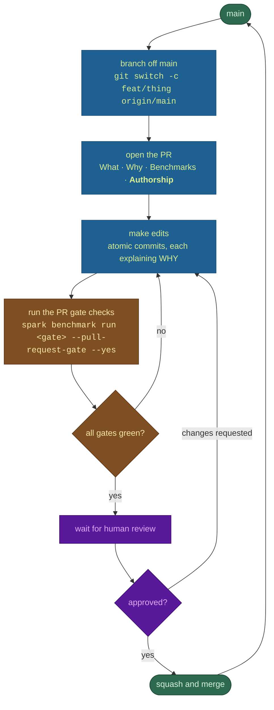

# Contributing to Atlas

WE thank you for your interest in Atlas! This document explains how to contribute effectively.

## Philosophy

Atlas follows the **AI Kernel HyperCompiling** philosophy: for every `(Hardware, Model_q)` tuple, there exists a set of kernels producing the highest performance such that it performs at the hardware's theoretical peak. Contributions should align with this — we value specialization over generalization.

### AI-First Codebase

Atlas is an **AI-first codebase**. We're reversing the conventional logic:

- **All PRs are expected to be AI-generated.** Use the best AI tools available to write your kernels, Rust code, and benchmarks.
- **Human-written code must be justified.** If you submit code written without AI assistance, you must explicitly denote which parts are human-authored and explain why a human wrote it better than an AI could.
- **Human-only contributions will be reviewed by AI.** We will subject human-written code to scrutiny by higher-intelligence AI systems to verify that the human approach is genuinely superior.

This is not a gimmick — it's the logical extension of our philosophy. If AI can hyperoptimize CUDA kernels for specific hardware targets, it can write the infrastructure too. Prove us wrong, and we'll happily merge your PR.

## Getting Started

### Prerequisites

- CUDA 13.0+ with `nvcc`
- Rust stable (see `rust-toolchain.toml`)
- NVIDIA GB10 GPU (for kernel testing — unit tests run without GPU)

### Build & Test

```bash
export CUDA_HOME=/usr/local/cuda-13.0

# Build (requires CUDA + nvcc)
cargo build --release
```

#### Testing without a GPU

Most contribution paths can be developed and validated without GPU
hardware. CI runs all of these on a standard `ubuntu-latest` runner:

```bash
# Rust correctness — no GPU, no nvcc required.
# ATLAS_SKIP_BUILD=1 makes atlas-kernels emit a stub instead of invoking
# nvcc; CUDARC_CUDA_VERSION short-circuits cudarc's `nvcc --version` probe.
# Both are needed. These are exactly what ci.yml sets workflow-wide.
ATLAS_SKIP_BUILD=1 CUDARC_CUDA_VERSION=13000 cargo check --workspace
ATLAS_SKIP_BUILD=1 CUDARC_CUDA_VERSION=13000 cargo clippy --workspace --tests
ATLAS_SKIP_BUILD=1 CUDARC_CUDA_VERSION=13000 cargo test --workspace
cargo fmt --all -- --check          # formatting
```

`scripts/check.sh` wraps the same idea, but it exports `SKIP_ATLAS_BUILD`, and
`crates/atlas-kernels/build.rs` matches on `ATLAS_SKIP_BUILD` only — so the
wrapper does **not** currently skip the PTX build. Use the explicit env vars
above until the script is fixed.

The file-size cap (≤500 LoC per `crates/**/*.rs`) is enforced by
`.github/workflows/file-size-cap.yml`, which carries a long allow-list of
rationale-documented carry-overs. A bare `find` knows nothing about that list —
it flags ~88 files today, nearly all of them allow-listed — so cross-check any
hit against the workflow before treating it as a violation:

```bash
find crates -name '*.rs' -not -name '*.bak' -not -path '*/target/*' \
  | xargs wc -l | awk '$1 > 500 && $2 != "total"'
```

Tests that need a GPU are gated behind `--ignored` and require GB10
hardware plus cached HuggingFace model weights:

```bash
# Integration tests — needs GB10 + ~30 GB+ model cache.
cargo test -p spark-server --release -- --ignored

# End-to-end multi-model sweep (the canonical regression suite).
# Requires Docker, NVIDIA Container Toolkit, optionally a 2-node
# DGX Spark cluster. Defaults to localhost for single-node runs.
python3 tests/run_all_models.py

# Microbenchmarks (single GPU).
cargo bench -p atlas-spark-bench
```

CI enforces (all GPU-free): `fmt`, `clippy`, `cargo test --workspace`
(unit tests + non-`#[ignore]` integration tests), license-headers, typo check,
**kernel shadow structure** (`scripts/check_kernel_shadows.py` — no shadow
byte-identical to its `common/` namesake, no duplicate regular copies of the
same shadow, and no undeclared regular file in an inheriting target's
`common/`), file-size cap (≤500 LoC per `crates/**/*.rs`), and mdBook +
`cargo doc --workspace --no-deps`. `cargo-deny` lives in its own workflow
(`.github/workflows/security.yml`), not in `ci.yml`.
PRs fail without an authoring maintainer needing GPU access — the kernel
work happens locally.

`ci.yml` also runs `test-macos-metal`, `release-matrix`, and an **advisory**
`pr-benchmark-gate` (`continue-on-error: true`) that checks committed
`.benchmarks/*` records against their baselines without reddening the PR.

**CI-green is not the same as shippable.** The GPU-free CI proves the code
compiles and is hygienic; it does *not* boot a model. An image is only
"verified" once it passes the **serve matrix** (`tests/run_all_models.py` +
the coherence gate). Deploying on GB10? Read
[`docs/GB10_DEPLOYMENT_GUIDE.md`](docs/GB10_DEPLOYMENT_GUIDE.md) for the model
compatibility matrix, quant selection, and known-issue workarounds. Cutting an
image? The build → verify → publish pipeline is the `atlas-release` skill
(`.claude/skills/atlas-release/`).

#### Coverage

`.github/workflows/coverage.yml` measures line/region coverage with
[`cargo-llvm-cov`](https://github.com/taiki-e/cargo-llvm-cov) on the same
GPU-free runner as `cargo test`, and uploads LCOV to Codecov. Reproduce it
locally with the exact command CI runs:

```bash
cargo install cargo-llvm-cov          # one-time
rustup component add llvm-tools-preview

scripts/coverage.sh lcov.info                  # LCOV + a per-file summary table
COVERAGE_HTML=1 scripts/coverage.sh lcov.info  # ...plus target/llvm-cov/html/
```

`scripts/coverage.sh` is the single source of truth for the invocation and for
the exclusion list — CI calls the same script, so a local number and a CI
number cannot drift. Excluded: `build.rs`, build-script-generated PTX,
vendored `cudarc`, the pure-FFI crates (`atlas-kernels`, `cufile-sys`,
`spark-comm`, `atlas-rdma/src/verbs.rs`), the `layers/ops/` kernel-launch
wrappers, and test/bench/example harnesses. All of those are unreachable
without a GB10, so counting them would measure the runner, not the test suite.
**Adding an exclusion requires a rationale comment next to it** — that list is
how a coverage number quietly turns into a decoration.

Both Codecov statuses (`project` and `patch`) are **informational on purpose**:
they report the delta on every PR but cannot block a merge while coverage is
still being built up. `codecov.yml` states the condition for tightening each
one; read it before assuming coverage is ungated forever.

Practical note: the workspace total is dominated by `crates/spark-model`, which
is overwhelmingly CUDA kernel dispatch a CPU-only runner cannot execute — it
measured **5%** of ~61k lines when this job was added (2026-08-06), against a
workspace total of **33%**. Well-tested host-side crates sit far higher in the
same run (`xgrammar` 87%, `atlas-plugin` 75%, `atlas-core` 54%). Read the
workspace number as a trend line, not a grade; the coverage that actually
moves is host-side logic — config/weight-map parsing, the scheduler's state
machine, the tool parser and grammar compiler, the tokenizer/chat-template
path, the TUI, and the API layer.

### Code Formatting

```bash
# Rust
cargo fmt --all

# CUDA kernels
find kernels/ -name '*.cu' -print0 | xargs -0 clang-format -i
```

## What to Contribute

### New (H, M<sub>q</sub>) Targets

Each hardware × model × quantization combination is a self-contained body of work. To add a new target:

1. Add kernel variants under `kernels/<hardware>/` optimized for the target SM
   architecture — `kernels/<hw>/common/` for sources every model shares, or
   `kernels/<hw>/<model>/<quant>/` to *shadow* a `common/` file for one target.
   `scripts/check_kernel_shadows.py` (CI job `kernel-structure`) rejects a shadow
   that is byte-identical to its `common/` namesake, and duplicate regular copies
   of the same shadow across models — symlink to one canonical file instead.
   A target whose `common/` MIRRORS another's (`kernels/hopper` and
   `kernels/b200` mirror `kernels/gb10`) may own a tuned source of its own, as a
   **real file** listed in its `HARDWARE.toml` `[kernels] overrides` — editing a
   symlink there would edit the other target's kernel, which is what the
   declaration exists to prevent. The check reports each target's override list.
2. Declare the target's SERVING levers in `kernels/<hardware>/HARDWARE.toml`
   `[defaults]`, and its `[hardware] sm_count`. `build.rs` bakes them into
   `atlas_kernels::TARGET_DEFAULTS` / `TARGET_SM_COUNT` and every resolver in
   `spark-model` reads the declaration before the environment, so a target's
   measured configuration is a reviewable file rather than a launch script.
   `crates/atlas-kernels/build_defaults.rs` panics on an unknown key. Adding a
   LEVER is one commit across four places — the `TargetDefaults` field, the
   parse arm, the resolver and every target's table — and that commit is the one
   landing the arm which reads it.
3. Register them in the appropriate `crates/atlas-*` kernel crate
4. Add benchmark shapes to `crates/atlas-spark-bench/`
5. Demonstrate speedup over the baseline (PyTorch, cuBLAS, etc.)

### Kernel Optimization

Profile existing kernels and submit improvements. Every PR should include:

- **Before/after timings** on the target hardware
- **What changed** — tiling strategy, register pressure, shared memory layout, etc.
- **Why it's faster** — brief explanation of the optimization

### Benchmark Coverage

Add new shapes and configurations to `crates/atlas-spark-bench/`. More data points help us find optimization opportunities.

### Bug Reports

Open an issue with:

- Hardware details (GPU model, driver version, CUDA version)
- Reproduction steps
- Expected vs actual behavior
- Kernel timings if applicable

## Code Standards

- **Rust** — `cargo fmt` and `cargo clippy -- -D warnings` must pass
- **CUDA** — `clang-format` with the repo's `.clang-format` config
- **No Python in the engine** — the shipped binary is pure Rust + CUDA and the
  image carries no Python runtime. Python is still the language of the *harnesses*
  around it: `tests/run_all_models.py`, `scripts/check_kernel_shadows.py` (a CI
  job), `scripts/dev/`, `bench/`. Don't add Python to `crates/`; do use it for
  test and benchmark drivers. (There is no `historical-python/` directory.)
- **Tests** — Add unit tests for new functionality. Use `MockGpuBackend` for tests that don't need a real GPU.

## Pull Request Process

The loop below is the whole process. It has exactly two exits: **merge**, or
**back to editing**. Nothing else advances, and nothing skips the gates.



### The same loop, for an agent

Machine-readable because an agent should not have to infer the contract from
prose. Each state names its exit condition and the command that proves it.

| # | State | Command | Advance when | Else |
|---|---|---|---|---|
| 1 | `branch` | `git switch -c <topic> origin/main` | branch exists, based on current `origin/main` | — |
| 2 | `open` | `gh pr create` | PR body has What, Why, Benchmarks, **Authorship** | fill them in |
| 3 | `edit` | — | change is complete and committed | — |
| 4 | `checks` | `cargo fmt --all -- --check`<br/>`cargo clippy --workspace --tests`<br/>`cargo test --workspace`<br/>`cargo doc --workspace --no-deps` | all four exit 0 | → 3 |
| 5 | `gates` | `./target/release/spark benchmark run <id> --pull-request-gate --yes` | every required gate PASSes at the **current tip** | → 3 |
| 6 | `cla` | reply to the CLA bot | signed | blocked |
| 7 | `review` | — | a human approves | → 3 |
| 8 | `merge` | maintainer squashes | — | — |

Invariants an agent must not violate:

- **A gate record is only valid for the commit that produced it.** Any change
  under `crates/`, `kernels/`, `Cargo.*`, `vendor/`, `jinja-templates/` or
  `rust-toolchain.toml` invalidates every record. Re-run the gates after your
  last code commit, not before it.
- **Never commit a record produced by a dirty tree.** It names a commit whose
  binary did not produce it, which is worse than having no record.
- **Never lower a threshold in `.benchmarks/*/BASELINE.json` to make a gate
  pass.** Those are evidence. If a gate is wrong, say so in the PR and argue it.
- **`cargo doc` is part of the sweep.** `fmt`, `clippy` and `test` all pass on a
  broken rustdoc; a dangling intra-doc link only fails under `cargo doc`.
- **Report what you measured, separately from what you inferred.** A precise
  negative result is worth more than a confident guess.

### Authorship, and why we ask

Atlas is an **AI-first codebase**, and the PR template's Authorship field is not
bookkeeping — it is the measurement. We expect essentially every PR to be
AI-generated, and we are tracking the exceptions on purpose.

- **AI-authored is the default and the target.** No justification needed.
- **Human-authored code must be defended.** Name the parts a human wrote and
  explain what the human did that the AI could not. "I found it faster by hand"
  is a real answer; so is "the AI produced something that measured worse, here
  are both numbers."
- **Those defences are the dataset.** Each one marks a place where the tooling
  is still behind, and each is a target for closing. The intent is that the
  share of human-written code trends toward zero — not because humans are
  unwelcome, but because every case where a human still has to intervene is a
  gap we would rather fix than institutionalise.
- **Human-written code gets reviewed by AI**, to check the claim that the human
  approach was genuinely better. This cuts both ways: if the review says the
  human was right, that is a finding worth keeping.

You will not be penalised for writing code by hand. You will be asked why.

## License & CLA

By contributing, you agree that your contributions will be governed by our [Contributor License Agreement (CLA)](CLA.md). Your work will be distributed in the Community Edition under the [AGPLv3 License](LICENSE) and you grant us the right to commercially re-license it for the Enterprise Edition.
