<p align="center">
  
</p>
<p align="center">
  <h1 align="center">Atlas Inference Engine</h1>
  <p align="center">
    <strong>Pure Rust LLM Inference</strong><br>
    <em>Universal Inference At Unimaginable Speeds</em>
  </p>
  <p align="center">
    
    
    
  </p>
  <p align="center">
    <a href="LICENSE"></a>
    <a href="#build"></a>
    <a href="https://hub.docker.com/r/avarok/atlas-gb10"></a>
    <a href="https://discord.gg/DwF3brBMpw"></a>
  </p>
</p>

<p align="center">
  <video src="https://github.com/user-attachments/assets/7909c9ca-ce36-4e79-8977-b32948909298" controls muted playsinline width="820"></video>
</p>

<p align="center">
  <a href="#run-atlas"></a>
  <a href="https://atlasinference.io"></a>
  <a href="https://x.com/AIshaqui81766/status/2052121270506930276"></a>
</p>

## Philosophy

The foundation of any given field of science is philosophy. It is that which inspires direction, structure, and mission.

Atlas began as a solution to widely known problem in using other (python) inference engines built by data scientists: the code was steeped in a poly codebase with an ever shifting ecosystem of dependencies, patches, and cross-dependencies. One day your workaround for running a model works, the next day you have to update to a nightly branch of several dependencies and inject a new workaround. This is not how you build a software ecosystem; that's how you build a proof of concept. We thank the great and hard work data scientists made in proving LLMs can revolutionize our world, its economy, and how it challenges us to higher epochs. Now, the software engineers take the torch to turn a proof of concept into something that is designed to withstand the test of time.

### Main Objective

Similar to how llama.cpp was built with the intent to prove you don't need $10000-$100000 GPUs to run LLMs, Atlas is built with the intent to consistently force the narrative that as hardware continues to advance, we should not have to pay premium Cloud API prices for inference. Atlas, by virtue of its philosophy, maximizes speed for each hardware/model combination, thus paving the way for meaningfully powerful and intelligent LLMs to be run locally in such a way the model is truly useful.

### Design Choices

#### Free and Open Source, Always

We promised this since the beginning. We believe great software comes from opening the source, not from just keeping it closed. The more eyes, the better. And therein brings us to the next point.

#### Community-First

For those who've followed us this far since the inception of our Discord, you know the extent to which our commitment to the community is, according to one user humourously put, "cracked". We want to build something incredible, and that means we not only build for you, but you, now having access to the source code, can now build for others in ways that triumph over existing solutions. This is the only way we all win. We are the Pirates of the inference space.

#### Monorepo

We chose a monorepo design to ensure that, as we head further into the agentic age of coding, the average data scientist or engineer can contribute meaningful PRs to any part of the system. Eventually, since this is a monorepo, there will be a day where the repo is autonomously self-improving and self-patching. This is most efficient and most effective when all the code is in one place, not many.

#### Hardware+Model Specific Kernels

We make no compromises or generalizations. Each hardware and model combination has its own unique properties that require fine-tuning custom kernels that leverage the model for that specific hardware configuration. The end result? 2-3x faster kernels all around.

#### AI-Friendly Codebase

It took a significant amount of time to build this codebase. We also know people will want to submit AI-generated PRs. We can't stop you, and in fact, given SOTA, you might just have to! The good news is that this codebase was built with enough railguards, structure, and abstraction to guide your AI to absorb the entire monorepo and contribute meaningfully. There's enough context to keep this going off the rails like a crazy train.This means ultimately that instead of waiting for days to weeks before getting model support, you can just fork this repo, and ask your AI to integrate it, then within hours you'll more likely than not have a working model running. We will not be condescending, [unlike some other inference engines out there when good-faith PRs that simply work are posted](https://github.com/ggml-org/llama.cpp/pull/18680#issuecomment-3723954542). We are not stymied by bureacracy, and want to enable the community to rapidly expand this monorepo ecosystem safely and effectively.

#### Theory-Friendly Codebase

Arxiv is getting countless papers published every day on AI. Nobody can keep up. Yet, some papers may be relevant to this project, others may not. Research endeavors to improve quality, alignment, and speed ought to be considered by our community as something we can integrate cleanly. Feel free to open a PoC PR here and just explain what you did and why, and how it works.

#### Plug and Play Design

Our system is modular, with tight abstraction boundaries and trait requirements that force the architecture to take on a certain form. This form is designed to prevent pigeon-holing the project into the wrong direction. The business logic is the same across all hardware/model combinations, just the concrete implementations differ.

## Architecture

The diagram below shows how a single HTTP request flows from the API surface down to hardware-specific CUDA kernel execution. **Dashed borders** mark the **plug-and-play** abstraction boundaries — the traits and registries where a new hardware target, model family, communication backend, or storage backend plugs in without touching the layers above or below it.

```mermaid
flowchart TB
    %% ── Colours & styles ──────────────────────────────────────────────
    classDef server fill:#2d6a4f,stroke:#1b4332,color:#d8f3dc
    classDef sched fill:#1d3557,stroke:#0d1b2a,color:#a8dadc
    classDef model fill:#6a040f,stroke:#370617,color:#fae0e4
    classDef runtime fill:#7b2cbf,stroke:#3c096c,color:#e0aaff
    classDef kernel fill:#e85d04,stroke:#9d0208,color:#fff
    classDef plug fill:none,stroke:#f48c06,stroke-width:3,stroke-dasharray:6 4,color:#f48c06
    classDef prim fill:#3a0ca3,stroke:#240046,color:#c8b6ff
    classDef hw fill:#264653,stroke:#2a9d8f,color:#e9f5db

    %% ════════════════════════════════════════════════════════════════
    %% 1. HTTP API  (spark-server)
    %% ════════════════════════════════════════════════════════════════
    CLIENT["Client<br/>(OpenAI / Anthropic API)"]
    API["spark-server — api.rs / anthropic.rs<br/>OpenAI + Anthropic HTTP surface<br/>Tool-call parsing · Streaming SSE"]:::server
    CLIENT --> API

    %% ════════════════════════════════════════════════════════════════
    %% 2. Scheduler  (spark-server/scheduler.rs)
    %% ════════════════════════════════════════════════════════════════
    SCHED["Scheduler<br/>Batched decode · Chunked prefill · MTP spec-decode<br/>Grammar FSM · Thinking-loop watchdog<br/>Sampling (argmax / top-k / top-p / DRY / LZ)"]:::sched
    API -->|"InferenceRequest<br/>via mpsc channel"| SCHED

    %% ════════════════════════════════════════════════════════════════
    %% 3. Model trait  (spark-model/traits.rs) — PLUG & PLAY
    %% ════════════════════════════════════════════════════════════════
    MODEL_TRAIT{{"🔌 trait Model<br/>(spark-model/traits.rs)<br/>prefill · decode · decode_batch<br/>mixed_forward · speculative verify"}}:::plug
    SCHED -->|"Box(dyn Model)"| MODEL_TRAIT

    %% ════════════════════════════════════════════════════════════════
    %% 4. Model factory + weight loaders  (spark-model)
    %% ════════════════════════════════════════════════════════════════
    FACTORY["factory.rs — loader_for_config()<br/>SSOT model_type → loader dispatch"]:::model
    MODEL_TRAIT --> FACTORY

    subgraph LOADERS ["🔌 Weight Loaders — trait ModelWeightLoader"]
        direction LR
        QWEN3["Qwen3<br/>qwen3.rs"]:::model
        QWEN35["Qwen3.5 / 3.6<br/>qwen35.rs"]:::model
        GEMMA4["Gemma-4<br/>gemma4.rs"]:::model
        NEMOTRON["Nemotron-H<br/>nemotron.rs"]:::model
        MINIMAX["MiniMax M2<br/>minimax.rs"]:::model
        MISTRAL["Mistral<br/>mistral_loader.rs"]:::model
        NEW_MODEL["🆕 Your Model<br/>impl ModelWeightLoader"]:::plug
    end
    FACTORY --> LOADERS

    %% ════════════════════════════════════════════════════════════════
    %% 5. Layer trait  (spark-model/layer.rs) — PLUG & PLAY
    %% ════════════════════════════════════════════════════════════════
    LAYER_TRAIT{{"🔌 trait TransformerLayer<br/>(spark-model/layer.rs)<br/>decode · prefill · decode_multi_seq<br/>SSM two-phase · MoE transpose"}}:::plug
    LOADERS --> LAYER_TRAIT

    subgraph LAYERS ["Layer Implementations"]
        direction LR
        ATTN["Qwen3 Attention<br/>(GQA · MLA · MRoPE)"]:::model
        SSM["Qwen3 SSM<br/>(GDN · Mamba-2)"]:::model
        MOE["MoE FFN<br/>(top-k · sigmoid-route)"]:::model
        DENSE["Dense FFN<br/>(GeGLU · SiLU)"]:::model
        VIS["Vision Encoder<br/>(ViT blocks)"]:::model
    end
    LAYER_TRAIT --> LAYERS

    %% ════════════════════════════════════════════════════════════════
    %% 6. GPU backend trait  (spark-runtime/gpu.rs) — PLUG & PLAY
    %% ════════════════════════════════════════════════════════════════
    GPU_TRAIT{{"🔌 trait GpuBackend<br/>(spark-runtime/gpu.rs)<br/>alloc · free · launch · copy_h2d/d2h<br/>CUDA graphs · pinned memory"}}:::plug
    LAYERS -->|"&dyn GpuBackend"| GPU_TRAIT

    subgraph GPU_IMPLS ["GPU Backend Implementations"]
        direction LR
        CUDA_BE["AtlasCudaBackend<br/>(production — CUDA driver)"]:::runtime
        MOCK_BE["MockGpuBackend<br/>(unit tests)"]:::runtime
        NEW_HW["🆕 Your Hardware<br/>impl GpuBackend"]:::plug
    end
    GPU_TRAIT --> GPU_IMPLS

    %% ════════════════════════════════════════════════════════════════
    %% 7. Runtime services  (spark-runtime)
    %% ════════════════════════════════════════════════════════════════
    subgraph RUNTIME ["spark-runtime"]
        direction TB
        KV["PagedKvCache<br/>BF16 · FP8 · NVFP4 · Turbo3/4/8"]:::runtime
        BUFS["BufferArena<br/>Pre-allocated scratch"]:::runtime
        WEIGHTS["WeightStore<br/>mmap / O_DIRECT loader"]:::runtime
        SAMPLER["Sampler<br/>argmax · top-k/p · temperature"]:::runtime
    end
    LAYERS --> RUNTIME

    %% ════════════════════════════════════════════════════════════════
    %% 8. Kernel registry  (atlas-core/registry.rs)
    %% ════════════════════════════════════════════════════════════════
    REGISTRY["AtlasRegistry<br/>Global PTX cache · cuLaunchKernel"]:::kernel
    CUDA_BE --> REGISTRY

    %% ════════════════════════════════════════════════════════════════
    %% 9. Kernel target system  (atlas-kernels) — PLUG & PLAY
    %% ════════════════════════════════════════════════════════════════
    KERNELS_CRATE{{"🔌 atlas-kernels<br/>KernelTarget = (HW × Model × Quant)<br/>build.rs → per-target PTX embedding<br/>MODEL.toml → SamplingPresets + ModelBehavior"}}:::plug
    REGISTRY --> KERNELS_CRATE

    subgraph TARGETS ["kernels/ — CUDA Kernel Targets"]
        direction TB
        subgraph GB10 ["kernels/gb10/ — HARDWARE.toml"]
            direction LR
            T1["qwen3-next-80b-a3b"]:::kernel
            T2["qwen3.5-35b-a3b"]:::kernel
            T3["gemma-4-26b-a4b"]:::kernel
            T4["nemotron-3-nano-30b"]:::kernel
            T5["minimax-m2-229b"]:::kernel
            T6["mistral-small-4"]:::kernel
            T7["+ 7 more targets"]:::kernel
        end
        NEW_TARGET["🆕 kernels/<hw>/<model>/<quant>/<br/>HARDWARE.toml + MODEL.toml + *.cu"]:::plug
    end
    KERNELS_CRATE --> TARGETS

    %% ════════════════════════════════════════════════════════════════
    %% 10. Communication  (spark-comm) — PLUG & PLAY
    %% ════════════════════════════════════════════════════════════════
    COMM_TRAIT{{"🔌 trait CommBackend<br/>(spark-comm/lib.rs)<br/>all_reduce · broadcast · send_to/recv_from<br/>Expert Parallelism (EP)"}}:::plug
    LAYERS -->|"&dyn CommBackend<br/>(EP all-reduce)"| COMM_TRAIT

    subgraph COMM_IMPLS ["Comm Implementations"]
        direction LR
        SINGLE["SingleGpuBackend<br/>(no-op)"]:::prim
        NCCL["NcclBackend<br/>(multi-GPU NCCL)"]:::prim
        NEW_COMM["🆕 Your Transport<br/>impl CommBackend"]:::plug
    end
    COMM_TRAIT --> COMM_IMPLS

    %% ════════════════════════════════════════════════════════════════
    %% 11. Storage  (spark-storage) — PLUG & PLAY
    %% ════════════════════════════════════════════════════════════════
    STORAGE_TRAIT{{"🔌 trait StorageBackend<br/>(spark-storage/backend)<br/>High-Speed Swap — NVMe KV offload<br/>Predictive eviction · Tiled attention"}}:::plug
    KV -->|"KV spill / restore"| STORAGE_TRAIT

    subgraph STORAGE_IMPLS ["Storage Implementations"]
        direction LR
        IOURING["IoUringBackend"]:::prim
        POSIX["PosixBackend"]:::prim
        NEW_STORAGE["🆕 Your Backend<br/>impl StorageBackend"]:::plug
    end
    STORAGE_TRAIT --> STORAGE_IMPLS

    %% ════════════════════════════════════════════════════════════════
    %% 12. Shared primitives  (atlas-*)
    %% ════════════════════════════════════════════════════════════════
    subgraph PRIMITIVES ["Shared Primitives (atlas-*)"]
        direction LR
        P1["atlas-core<br/>Config · KernelTarget<br/>Registry · Compute"]:::prim
        P2["atlas-quant<br/>NVFP4 · FP8"]:::prim
        P3["atlas-norm<br/>RMS norm"]:::prim
        P4["atlas-embed<br/>Embedding"]:::prim
        P5["atlas-reduce<br/>Reductions"]:::prim
        P6["atlas-activation<br/>SiLU · GeGLU"]:::prim
    end
    LAYERS -.->|"kernel wrappers"| PRIMITIVES
```



### Reading the Diagram

**Solid boxes** are concrete implementations. **Dashed borders with 🔌** are the trait-based abstraction boundaries — each is a Rust trait (or a filesystem convention for kernels) where a new integration plugs in:

| Plug Point | What It Abstracts | To Add New Support |
|---|---|---|
| `trait Model` | Full model forward pass | Rarely needed — the existing `TransformerModel` handles all architectures via composable layers |
| `trait ModelWeightLoader` | HuggingFace → layer translation | **Implement one struct** with weight-name patterns for your model family ([`factory.rs`](crates/spark-model/src/factory.rs) adds one match arm) |
| `trait TransformerLayer` | Per-layer compute (attn, SSM, MoE, FFN) | Compose existing layer types or implement a new one for novel architectures |
| `trait GpuBackend` | All GPU memory and kernel ops | Swap the CUDA driver for another accelerator backend |
| `kernels/<hw>/<model>/<quant>/` | Hardware-tuned CUDA kernels | Drop a new directory with `MODEL.toml` + `.cu` files; `build.rs` auto-discovers it |
| `trait CommBackend` | Multi-GPU collective communication | Implement for MPI, GDR, or custom interconnects |
| `trait StorageBackend` | NVMe KV-cache offload I/O | Implement for CXL, RDMA, or other storage tiers |

### Data Flow Summary

1. **HTTP** → `spark-server` receives OpenAI/Anthropic requests, tokenizes, and enqueues
2. **Scheduler** → batches sequences, orchestrates prefill/decode/speculative-verify steps
3. **Model** → generic loop: `embed → [layer₀ … layerₙ] → norm → lm_head`
4. **Layers** → each layer dispatches through `GpuBackend` to launch kernels from `AtlasRegistry`
5. **Kernels** → pre-compiled PTX selected by `(hardware × model × quant)` target at build time
6. **EP** → `CommBackend` handles cross-GPU all-reduce after MoE expert computation
7. **Storage** → `StorageBackend` spills/restores KV blocks to NVMe for long-context sequences

## What We Ship Today

We have to walk before we can run. Today's Atlas is targeted at a single hardware platform — NVIDIA's GB10 (DGX Spark, SM121) — and twelve hand-tuned (Hardware × Model × Quantization) targets. Every supported model below runs off one multi-model binary; the right kernel set is selected at startup from the model's `config.json`. No swapping images, no rebuilding, no per-model magic — just point Atlas at a HuggingFace ID.

| Family | Model | HuggingFace ID | Params / active | Architecture |
|---|---|---|---:|---|
| Qwen3.5 | Qwen3.5-27B | `Kbenkhaled/Qwen3.5-27B-NVFP4` | 27B dense | Hybrid SSM + attention, dense FFN, MRoPE |
| Qwen3.5 | Qwen3.5-35B-A3B | `Sehyo/Qwen3.5-35B-A3B-NVFP4` | 35B / 3B | GDN + attention + MoE, MTP |
| Qwen3.5 | Qwen3.5-122B-A10B | `Sehyo/Qwen3.5-122B-A10B-NVFP4` | 122B / 10B | GDN + attention + MoE, MTP |
| Qwen3.6 | Qwen3.6-35B-A3B | `Qwen/Qwen3.6-35B-A3B-FP8` | 35B / 3B | GDN + attention + MoE, MRoPE, vision tower |
| Qwen3-Next | Qwen3-Next-80B-A3B | `nvidia/Qwen3-Next-80B-A3B-Instruct-NVFP4` | 80B / 3B | SSM + attention + MoE |
| Qwen3-VL | Qwen3-VL-30B-A3B | `ig1/Qwen3-VL-30B-A3B-Instruct-NVFP4` | 30B / 3B | Vision + attention + MoE |
| Gemma-4 | Gemma-4-26B-A4B | `bg-digitalservices/Gemma-4-26B-A4B-it-NVFP4A16` | 26B / 4B | Attention + MoE, GeGLU |
| Gemma-4 | Gemma-4-31B | `nvidia/Gemma-4-31B-IT-NVFP4` | 31B dense | Attention (sliding + full), GeGLU |
| Mistral | Mistral-Small-4-119B | `mistralai/Mistral-Small-4-119B-2603-NVFP4` | 119B / 6.5B | Attention + MoE |
| MiniMax | MiniMax-M2.7 | `lukealonso/MiniMax-M2.7-NVFP4` | 229B / ~10B | Attention + 256-expert MoE + MTP |
| Nemotron-H | Nemotron-3-Nano-30B-A3B | `nvidia/NVIDIA-Nemotron-3-Nano-30B-A3B-NVFP4` | 30B / 3B | Mamba-2 + attention + MoE |
| Nemotron-H | Nemotron-3-Super-120B-A12B | `nvidia/NVIDIA-Nemotron-3-Super-120B-A12B-NVFP4` | 120B / 12B | Mamba-2 + attention + MoE |

This is a starting point, not a destination. The plug-and-play design above exists precisely so that AMD, Apple Silicon, Intel, and the next round of Blackwell parts can land here as community contributions, and so that the Llama 4s and DeepSeek V4s of next quarter slot in the same way the Qwens did this quarter. We did the hard part — bolting in the abstractions while bringing up the first twelve targets — so that adding the thirteenth is a weekend, not a quarter.

## Performance

We're not going to spend much real estate on benchmark theatre. The numbers below are what the binary in this repository does on a single NVIDIA GB10, on a short prompt (`"What is the capital of France?"`, `max_tokens ≤ 30`, `temperature = 0.1`), measured end-to-end through the HTTP API. They are reproducible: `scripts/sweep_all_models.sh` is the harness, and the source for every kernel that produced them is in this repository.

| Model | Mode | tok/s |
|---|---|---:|
| Qwen3.5-35B-A3B | MTP speculative (K=2) | **131** |
| Qwen3.5-35B-A3B | turbo4 KV | 77 |
| Qwen3.5-35B-A3B | No speculative | 70 |
| Qwen3-Next-80B-A3B | FP8 KV | 74 |
| Qwen3.5-122B-A10B | EP=2, MTP K=2 (600-tok sustained) | 46 |
| Qwen3.5-122B-A10B | FP8 KV, single-GPU tuned | 32 |
| Qwen3-VL-30B-A3B | NVFP4 KV | 97 |
| Nemotron-3-Nano-30B-A3B | FP8 KV | 88 |
| Nemotron-3-Super-120B | FP8 KV | 24 |
| Gemma-4-26B-A4B | default | 67 |
| Gemma-4-31B | `--max-batch-size 2` | 9 |
| Mistral-Small-4-119B | NVFP4 | 33 |
| Qwen3.5-27B (dense hybrid) | FP8 KV | 13 |

We compete with vLLM and TensorRT-LLM on the same GB10. On Qwen3.5-35B-A3B with MTP speculative decoding, Atlas decodes faster than the same model under NVIDIA's own vLLM build on the same hardware — meaningfully faster, on numbers we can hand you the script for. We will not put a bigger figure in this paragraph than the one that comes off our own benchmark scripts, and we publish the vLLM baseline command alongside ours so you can verify both. If you reproduce a faster vLLM number, file an issue. We would rather be measured than congratulated.

The kernel-by-kernel comparison against PyTorch eager (35 hyperoptimized CUDA kernels, all wins on production-relevant shapes) lives in the [benchmarks chapter](book/src/operations/benchmarks.md) along with the methodology footnotes — read them; they matter.

## KV Cache Quantization

Atlas stores attention key/value state in one of six quantized formats, selected via `--kv-cache-dtype`. Lower bit-widths fit more tokens in GPU memory at the cost of precision; the Turbo family adds Walsh-Hadamard rotation and Lloyd-Max optimal codebooks to recover accuracy at the same bit rate. Mix dtypes per layer with `--kv-high-precision-layers` to keep boundary layers at BF16 while compressing the middle.

| CLI flag | Bits/element | Scale overhead | Technique | When to use |
|---|---:|---|---|---|
| `bf16` | 16 | — | Raw BF16 storage | Maximum precision; short-context or quality-critical workloads |
| `fp8` | 8 | Per-tensor FP32 scale (from checkpoint or online calibration via `--fp8-kv-calibration-tokens`) | FP8 E4M3 with static or calibrated per-tensor scale | **Default.** Safe baseline — half the memory of BF16, minimal quality loss for most models |
| `turbo8` | 8 | Per-group BF16 scale (2 bytes / 16 elements) | Walsh-Hadamard rotation → FP8 E4M3 + BF16 per-group scales | FP8-level memory with outlier suppression; recommended for many-layer models (e.g. MiniMax M2.7, 58 layers) where per-group FP8 scales compound |
| `nvfp4` | 4 | Per-group FP8 scale (1 byte / 16 elements) | E2M1 packed nibbles (NVIDIA NVFP4 format) | 4× compression vs BF16; good for long-context with `--kv-high-precision-layers auto` |
| `turbo4` | 4 | Per-group FP8 scale (1 byte / 16 elements) | Walsh-Hadamard rotation → Lloyd-Max optimal 4-bit codebook | ~2× lower MSE than NVFP4 at the same bit rate; same memory footprint |
| `turbo3` | 3 | Per-group FP8 scale (1 byte / 16 elements) | Walsh-Hadamard rotation → Lloyd-Max 3-bit codebook (8 levels, packed 8 values → 3 bytes) | Maximum compression (22% smaller than turbo4); experimental |

## Quick Start

The whole supported model matrix lives in one Docker image. Pull it, mount your HuggingFace cache, point Atlas at any model ID from the table above:

<a id="run-atlas"></a>

```bash
docker pull avarok/atlas-gb10:latest

sudo docker run -d --name atlas \
  --network host --gpus all --ipc=host \
  -v ~/.cache/huggingface:/root/.cache/huggingface \
  avarok/atlas-gb10:latest \
  serve Qwen/Qwen3.6-35B-A3B-FP8 \
    --port 8888 \
    --max-seq-len 65536 \
    --kv-cache-dtype fp8 \
    --kv-high-precision-layers auto \
    --gpu-memory-utilization 0.90 \
    --scheduling-policy slai \
    --quantization fp8 \
    --tool-call-parser qwen3_coder \
    --enable-prefix-caching \
    --speculative
```

That's it. Anything OpenAI-compatible — `curl`, the OpenAI SDK, Open WebUI, opencode — points at port 8888:

```bash
curl http://localhost:8888/v1/chat/completions \
  -H "Content-Type: application/json" \
  -d '{"model":"atlas","messages":[{"role":"user","content":"Hello!"}],"max_tokens":256}'
```

Per-model recipes (vision, MoE, multi-node EP=2, single-GPU 122B with the tighter budget) live in [`QUICKSTART.md`](QUICKSTART.md). Build-from-source instructions are in [`CONTRIBUTING.md`](CONTRIBUTING.md), and the kernel build pipeline is documented in [`docs/ARCHITECTURE.md`](docs/ARCHITECTURE.md#build-pipeline).

## Adding a New Hardware Target

The full recipe is in [`docs/HARDWARE.md`](docs/HARDWARE.md#adding-a-new-hardware-target). The short version: implement two traits (`ComputeTarget` for the build-time compiler, `GpuBackend` for the runtime), drop kernel sources into `kernels/<your-hw>/`, add one match arm in the registry. There is a `MockGpuBackend` in `spark-runtime` that lets you write and test the entire scaffold without owning the hardware — every layer above the GPU trait is hardware-agnostic, so unit tests can run on a laptop. We bolted the project from "single CUDA target" to "trait-pluggable across vendors" specifically so that the AMD, Apple, and Intel ports stop being our problem and start being yours.

## Adding a New Model

Same story, smaller surface. Implement `ModelWeightLoader` (one struct, the existing `Qwen3AttentionLayer`/`MoeLayer`/`Qwen3SsmLayer`/`NemotronMamba2Layer` primitives cover most architectures), add one line to the factory dispatch, optionally drop a `MODEL.toml` for sampling defaults and behavior knobs. Kernels are reused; the scheduler is untouched; the server is oblivious. The step-by-step cookbook is in [`docs/HARDWARE.md`](docs/HARDWARE.md#adding-a-new-model-family). Once your loader produces coherent output on the integration coherence prompt, you are done — file the PR.

## Citations

We did not invent the kernels we ship. We picked the right ideas from the right papers, fused them together, and tuned them for one chip until they pinned the bandwidth ceiling. Atlas owes a direct intellectual debt to:

- **FlashAttention-2** — Tri Dao. *FlashAttention-2: Faster Attention with Better Parallelism and Work Partitioning.* ICLR 2024. [arXiv:2307.08691](https://arxiv.org/abs/2307.08691) — tiled online softmax, Q/K/V SMEM staging, causal masking. Foundation of our prefill kernel.
- **FlashAttention-4** — Shah, Bikshandi, Zhang, Thakkar, Ramani, Dao. *FlashAttention-4: Taming the Hardware.* 2025. [arXiv:2603.05451](https://arxiv.org/abs/2603.05451) — conditional softmax rescaling and software polynomial `sw_exp` (3 FMA + `ldexpf` instead of going through the SFU). Both shipped in our GQA-fused paged Flash Attention.
- **FlashInfer** — Ye, Chen, Lai, Zhao, Zheng, Shao, Hou, Jin, Zuo, Yin, Chen, Ceze. *FlashInfer: Efficient and Customizable Attention Engine for LLM Inference Serving.* MLSys 2025 (Best Paper). [arXiv:2501.01005](https://arxiv.org/abs/2501.01005) — block-sparse paged KV cache, page index prefetch to SMEM, the gather-SMEM-MMA pattern for scattered pages. Informed our paged attention design.
- **SageAttention 3** — Zhang, Huang, Zhang, Wei, Zhu, Chen. *SageAttention3: Microscaling FP4 Attention on Blackwell GPUs.* NeurIPS 2025 Spotlight. [arXiv:2505.11594](https://arxiv.org/abs/2505.11594) — FP4 attention with FP8 per-block microscales. On the SM121 roadmap once silicon-level FP4 MMA arrives upstream.
- **LeanAttention** — Roy, Vassilieva, Willke, Mendis. *LeanAttention: Hardware-Aware Scalable Attention for LLM Inference.* 2024. [arXiv:2405.10480](https://arxiv.org/abs/2405.10480) — stream-K tile scheduling for near-100% SM occupancy in split-K decode attention. Planned next.

If you wrote one of these papers and you spot a misattribution or a wrong technique credit on our side, open an issue. We would rather be corrected than wrong.

## License and Enterprise Edition

Atlas operates under a **dual-license** model. Both are real, both are intentional, and neither is a teaser for the other.

1. **[Community Edition](LICENSE) — AGPLv3.** Free, open, copyleft. Use it for yourself to run inference on your own hardware, research, hobby projects, side-projects, and/or hosted demos, as examples. If you want to make money from Atlas, purchase a commercial license.
2. **Enterprise Edition — commercial license.** If you need to ship Atlas inside a closed-source product, run it as a SaaS backend without inheriting the AGPLv3 source-disclosure obligation, or simply want a support relationship with the people who wrote the kernels, contact sales. Enterprise customers also receive prioritized model and hardware ports.

This split exists for a single reason: a permissive license keeps us building Atlas full-time, and the AGPL community license keeps the project honest. What is in this repository is what we run.