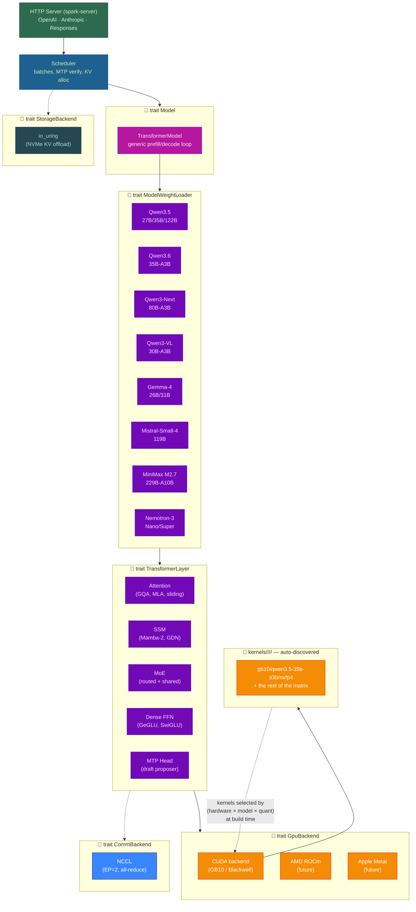
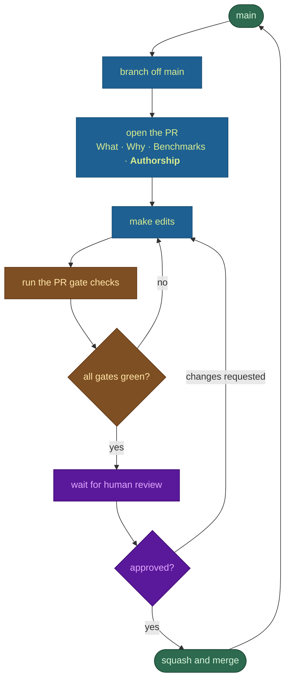
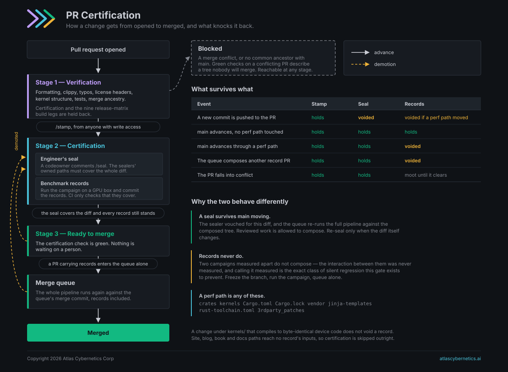

<h1 align="center">
  <picture>
    <source media="(prefers-color-scheme: dark)" srcset="assets/brand/logo-full-ondark.svg">
    <source media="(prefers-color-scheme: light)" srcset="assets/brand/logo-full.svg">
    
  </picture>
</h1>

<p align="center">
  <strong>Pure Rust LLM inference, from the device in your hand to the datacenter rack.</strong>
</p>

<p align="center">
  <a href="https://atlasinference.io"><strong>Website</strong></a> ·
  <a href="https://docs.atlasinference.io"><strong>Docs</strong></a> ·
  <a href="https://blog.atlasinference.io"><strong>Blog</strong></a> ·
  <a href="https://discord.gg/RQcGakU2jW"><strong>Discord</strong></a> ·
  <a href="docs/GB10_DEPLOYMENT_GUIDE.md"><strong>Deployment Guide</strong></a>
</p>

<p align="center">
  
  
  <a href="LICENSE"></a>
  
  <a href="https://hub.docker.com/r/avarok/atlas-gb10"></a>
  <a href="https://discord.gg/RQcGakU2jW"></a>
</p>

<p align="center">
  <a href="assets/atlas-demo.mp4"></a>
</p>

**Atlas** is an open-source **LLM inference engine** written in pure **Rust and CUDA**. It serves an **OpenAI-compatible server** (plus Anthropic and Responses APIs) from a single ~75 MB binary — no Python, no PyTorch, no runtime compilation — with hand-tuned **CUDA kernels** per (hardware × model × quantization) target, **NVFP4 and FP8 quantization**, **speculative decoding** (MTP draft heads and DFlash block diffusion), radix-tree prefix caching, and expert parallelism across nodes. It is verified today on the NVIDIA **DGX Spark** (**GB10**, **Blackwell** SM121), compiles the same CUDA source for AMD Strix Halo (gfx1151) through [SCALE](https://docs.scale-lang.com/stable/), and on the published GB10 concurrency ladder it out-serves vLLM at every rung from C=1 to C=128 — [conditions below](#performance).

Receipts, not adjectives:

- Our fused Qwen Gated DeltaNet kernel is [merged into Hugging Face Transformers](https://github.com/huggingface/transformers/pull/46423).
- We sit on the MLCommons Edge-LLM taskforce and [helped shape the MLPerf Inference v6.1 edge agentic benchmark](https://mlcommons.org/2026/07/mlperf-inference-v61-edge-agentic/); our v6.1 submission is in (closed edge division, GB10 and gfx1151 from the same CUDA source), with results under embargo until MLCommons publishes.
- Every release image passes a serve gate: boot, coherence, tool calls, and throughput within tolerance of a committed baseline. A release that ships slower than its baseline fails the gate.
- The engineering story is written up in the open on the [Atlas blog](https://blog.atlasinference.io), starting with [the seven tenets behind the engine](https://blog.atlasinference.io/posts/seven-tenets-powering-atlas-inference).

---

## 📑 Table of Contents

- [🚀 Quick Start](#quick-start)
- [🖥️ Supported Hardware](#hardware)
- [📦 Supported Models](#models)
- [⚡ Performance](#performance)
- [🗜️ KV Cache Quantization](#kv-cache)
- [🏛️ Architecture](#architecture)
- [🧭 Why Atlas Exists](#philosophy)
- [🔌 Adding a New Hardware Target](#new-hardware)
- [🧬 Adding a New Model](#new-model)
- [🔬 Kernel Debugging](#debugging)
- [🔐 How a Change Lands](#certification)
- [🤝 Community and Contributing](#community)
- [📚 Citations](#citations)
- [⚖️ License and Enterprise Edition](#license)

---

<a id="quick-start"></a>

## 🚀 Quick Start

### One command

```bash
curl -fsSL https://atlasinference.io/install.sh | sh
atlasctl run qwen3.6-35b-a3b-fp8-mtp
```

The script downloads a prebuilt `atlasctl`, verifies its checksum, and installs it to `~/.local/bin` — no Python, no Rust toolchain. Prefer not to pipe curl into a shell? `cargo install atlasctl` does the same from source. Every runnable model maps to a recipe in [atlas-recipes](https://github.com/Avarok-Cybersecurity/atlas-recipes), so the catalogue cannot list a model we do not ship.

### Docker

The whole supported model matrix lives in one image. Pull it, mount your HuggingFace cache, and point `serve` at any model ID from the [model table](#models).

> [!TIP]
> The recipes below are tuned for **maximum accuracy under agentic-coding workloads** — 64K context, BF16 MTP draft head (highest acceptance rate ⇒ highest end-to-end throughput), prefix caching for multi-turn tool loops, and FP8 KV cache with `auto`-promoted boundary layers. These are the exact configurations we use to drive opencode / Claude Code / Cline through Atlas on a single Spark.

#### Recipe 0 — no flags, pick a model in the TUI

Omit the model ID and `serve` boots into the Library — pick a model and recipe interactively (TTY only):

```bash
docker run -it --rm --network host --gpus all --ipc=host \
  -v "${HOME}/.cache/huggingface:/root/.cache/huggingface" \
  -v "${HOME}/.atlas:/root/.atlas" \
  avarok/atlas-gb10:latest serve
```

- `-it` — the TUI needs a real terminal to render (and Esc to quit).
- `--rm` — throwaway container; nothing to clean up after the session.
- `--network host` — the served port is reachable on localhost directly, no `-p` mapping.
- `--gpus all` — hands the GB10 to the container.
- `--ipc=host` — host-sized shared memory; the Docker default 64 MB `/dev/shm` is too small for CUDA.
- `-v ~/.cache/huggingface` — reuse the host's model cache instead of re-downloading weights.
- `-v ~/.atlas` — persist Atlas state (recipes, benchmark records, artifacts) across runs.

<a id="run-atlas"></a>

#### Recipe A — Qwen3.6-35B-A3B (FP8 hybrid MoE, the daily driver)

35 B params, 3 B active, GDN + attention + 256-expert MoE, MRoPE-positioned vision tower (text-only here).

```bash
docker pull avarok/atlas-gb10:latest

sudo docker run -d --name atlas \
  --network host --gpus all --ipc=host \
  -v ~/.cache/huggingface:/root/.cache/huggingface \
  avarok/atlas-gb10:latest \
  serve Qwen/Qwen3.6-35B-A3B-FP8 \
    --port 8888 \
    --max-seq-len 65536 \
    --kv-cache-dtype fp8 \
    --kv-high-precision-layers auto \
    --gpu-memory-utilization 0.90 \
    --scheduling-policy slai \
    --enable-prefix-caching \
    --speculative \
    --num-drafts 2 \
    --tool-call-parser qwen3_coder
```

Why these flags:

- `--max-seq-len 65536` — 64K window for long agent traces, file reads, multi-step tool use.
- `--kv-cache-dtype fp8 --kv-high-precision-layers auto` — half the memory of BF16, no measurable quality loss; the boundary attention blocks stay BF16, where the routing distribution is most sensitive. `auto` is **not** a heuristic — it is a fixed alias for `2` (`serve_phases/kv_cache.rs`), alongside `max`/`all` meaning "every attention layer". Because it is non-zero it also *suppresses* the per-dtype automatic promotion that `0` would trigger under a `turbo*` KV dtype.
- `--scheduling-policy slai` — SLAi scheduler. **Not the default** — `serve` defaults to `fifo`, so this flag has to be passed to get SLO-aware ordering. It reorders concurrent sequences to keep MTP verify batches dense and prefills shortest-prompt-first.
- `--enable-prefix-caching` — radix-tree prefix cache; tool-use sessions reuse the system prompt + tool-defs + earlier turns.
- `--speculative --num-drafts 2` — MTP draft head proposes 2 tokens per step. **No `--mtp-quantization` flag** ⇒ defaults to **BF16**, which gives the highest acceptance rate (lossier MTP projections lower acceptance and usually *worsen* end-to-end tok/s, despite the faster draft forward).
- `--tool-call-parser qwen3_coder` — explicit Qwen XML tool format. Atlas auto-resolves the right parser from `tool_defaults.toml` per model; pass it anyway in production scripts.

#### Recipe B — Qwen3.5-35B-A3B (NVFP4, ~131 tok/s with MTP K=2)

The fastest model in the matrix on a single Spark.

```bash
sudo docker run -d --name atlas \
  --network host --gpus all --ipc=host \
  -v ~/.cache/huggingface:/root/.cache/huggingface \
  avarok/atlas-gb10:latest \
  serve Sehyo/Qwen3.5-35B-A3B-NVFP4 \
    --port 8888 \
    --max-seq-len 65536 \
    --kv-cache-dtype fp8 \
    --kv-high-precision-layers auto \
    --gpu-memory-utilization 0.90 \
    --scheduling-policy slai \
    --enable-prefix-caching \
    --speculative \
    --tool-call-parser qwen3_coder
```

`--num-drafts` is omitted so it defaults to `1`, i.e. MTP **K=2** (the CLI defines `--num-drafts 1` as K=2, `2` as K=3). K=2 is the measured-fastest verify width for this model; K=3 is slower.

#### Recipe C — Qwen3.5-122B-A10B (NVFP4, single Spark)

The 122B NVFP4 weights + Atlas runtime overhead leave only ~2 GB for KV cache on a 119.7 GB GB10, so this recipe sacrifices `--speculative` (the MTP draft head + draft KV costs ~1.5 GB) to keep a real 16 K context window. Verified end-to-end: model loads, `/v1/chat/completions` answers correctly, 4-way concurrent serves cleanly.

```bash
sudo docker run -d --name atlas \
  --network host --gpus all --ipc=host \
  -v ~/.cache/huggingface:/root/.cache/huggingface \
  avarok/atlas-gb10:latest \
  serve Sehyo/Qwen3.5-122B-A10B-NVFP4 \
    --port 8888 \
    --max-seq-len 16384 \
    --kv-cache-dtype fp8 \
    --kv-high-precision-layers auto \
    --gpu-memory-utilization 0.92 \
    --scheduling-policy slai \
    --max-batch-size 1 \
    --max-num-seqs 4 \
    --oom-guard-mb 1024 \
    --ssm-cache-slots 0 \
    --tool-call-parser qwen3_coder
```

For 122B with **both** `--speculative` *and* a 64 K window, move to EP=2 across two Sparks ([`QUICKSTART.md` §7](QUICKSTART.md#7-qwen35-122b-moe--ep2-two-dgx-sparks-51-toks)). For long contexts on a single Spark, add `--high-speed-swap --high-speed-swap-dir /path/on/nvme --high-speed-swap-cache-blocks-per-seq 64` — HSS keeps a rolling 1024-token KV window in HBM and streams older blocks to NVMe through an io_uring orchestrator. The container needs `--security-opt seccomp=unconfined --ulimit memlock=-1` for io_uring access.

### Hitting the endpoint

Atlas speaks the OpenAI, Anthropic, and Responses APIs on the same port. `curl`, the OpenAI SDK, Open WebUI, opencode, Cline, Claude Code — point them at port 8888:

```bash
curl http://localhost:8888/v1/chat/completions \
  -H "Content-Type: application/json" \
  -d '{
    "model":"atlas",
    "messages":[{"role":"user","content":"Hello!"}],
    "max_tokens":256
  }'
```

Per-model recipes (vision input, video input, multi-node EP=2, single-GPU 122B with the tighter budget) live in [`QUICKSTART.md`](QUICKSTART.md), and the long-form manual is at [docs.atlasinference.io](https://docs.atlasinference.io).

> [!NOTE]
> **Video input requires `ffmpeg` on the host.** Images need nothing extra, and animated GIF decodes in-process — but MP4/MOV, WebM and AVI (H.264, H.265, VP9, AV1) are decoded by running `ffmpeg`, which must be installed and enabled with `--video-allow-ffmpeg`. Atlas deliberately does not link a video decoder; see [`QUICKSTART.md`](QUICKSTART.md) for the recipe and the reasoning. Build-from-source instructions are in [`CONTRIBUTING.md`](CONTRIBUTING.md), and the kernel build pipeline is documented in [`docs/ARCHITECTURE.md`](docs/ARCHITECTURE.md#build-pipeline).

<a id="hardware"></a>

## 🖥️ Supported Hardware

One engine, one kernel tree per target, no generic fallbacks. Each directory under [`kernels/`](kernels/) is a hardware target with its own `HARDWARE.toml`:

| Target | Silicon | Status |
|---|---|---|
| **NVIDIA DGX Spark** (`kernels/gb10`) | GB10 Grace-Blackwell, SM121, ~120 GB unified LPDDR5X | **Verified.** The reference platform — every release passes the serve gate here |
| **AMD Strix Halo** (`kernels/strix`, `kernels/strix-hip`) | Ryzen AI Max+ 395, RDNA 3.5 iGPU, gfx1151 | The **same unmodified CUDA sources**, recompiled for AMD via [SCALE](https://docs.scale-lang.com/stable/) — no hand-ported kernels (`strix-hip` is the HIP-toolchain build variant of the same sources). AMD provided the Strix Halo desktop we brought Atlas up on and included in our MLPerf Inference v6.1 submission |
| **Apple Silicon** (`kernels/metal`) | Metal 3.1, M2+ | Early bring-up — small-model targets only |
| **Multi-node** | 2× GB10 over RoCEv2 | EP=2 expert parallelism shipped as recipes; a 4-node EP=4 topology exists for the 397B target |

Porting to new silicon is a scoped piece of work, not an architectural change — see [Adding a New Hardware Target](#new-hardware).

<a id="models"></a>

## 📦 Supported Models

Every supported model runs off one multi-model binary; the right kernel set is selected at startup from the model's `config.json`. No swapping images, no rebuilding, no per-model magic — just point Atlas at a HuggingFace ID.

| Family | Model | HuggingFace ID | Params / active | Architecture |
|---|---|---|---:|---|
| Qwen3.5 | Qwen3.5-27B | `Kbenkhaled/Qwen3.5-27B-NVFP4` | 27B dense | Hybrid SSM + attention, dense FFN, MRoPE |
| Qwen3.5 | Qwen3.5-35B-A3B | `Sehyo/Qwen3.5-35B-A3B-NVFP4` | 35B / 3B | GDN + attention + MoE, MTP |
| Qwen3.5 | Qwen3.5-122B-A10B | `Sehyo/Qwen3.5-122B-A10B-NVFP4` | 122B / 10B | GDN + attention + MoE, MTP |
| Qwen3.6 | Qwen3.6-35B-A3B | `Qwen/Qwen3.6-35B-A3B-FP8` | 35B / 3B | GDN + attention + MoE, MRoPE, vision tower |
| Holo-3.1 | Holo-3.1-35B-A3B | `Hcompany/Holo-3.1-35B-A3B-NVFP4` | 35B / 3B | GDN + attention + 256-expert MoE, Qwen3-VL vision |
| Holo-3.1 | Holo-3.1-0.8B | `Hcompany/Holo-3.1-0.8B` | 0.8B dense | GDN + attention + dense FFN, Qwen3-VL vision |
| Ornith | Ornith-1.0-9B | `deepreinforce-ai/Ornith-1.0-9B` | 9B dense | GDN + attention + dense FFN, Qwen3-VL vision, MRoPE |
| Qwen3-Next | Qwen3-Next-80B-A3B | `nvidia/Qwen3-Next-80B-A3B-Instruct-NVFP4` | 80B / 3B | SSM + attention + MoE |
| Qwen3-VL | Qwen3-VL-30B-A3B | `ig1/Qwen3-VL-30B-A3B-Instruct-NVFP4` | 30B / 3B | Vision + attention + MoE |
| Gemma-4 | Gemma-4-26B-A4B | `bg-digitalservices/Gemma-4-26B-A4B-it-NVFP4A16` | 26B / 4B | Attention + MoE, GeGLU |
| Gemma-4 | Gemma-4-31B | `nvidia/Gemma-4-31B-IT-NVFP4` | 31B dense | Attention (sliding + full), GeGLU |
| Mistral | Mistral-Small-4-119B | `mistralai/Mistral-Small-4-119B-2603-NVFP4` | 119B / 6.5B | Attention + MoE |
| MiniMax | MiniMax-M2.7 | `lukealonso/MiniMax-M2.7-NVFP4` | 229B / ~10B | Attention + 256-expert MoE + MTP |
| Nemotron-H | Nemotron-3-Nano-30B-A3B | `nvidia/NVIDIA-Nemotron-3-Nano-30B-A3B-NVFP4` | 30B / 3B | Mamba-2 + attention + MoE |
| Nemotron-H | Nemotron-3-Super-120B-A12B | `nvidia/NVIDIA-Nemotron-3-Super-120B-A12B-NVFP4` | 120B / 12B | Mamba-2 + attention + MoE |

The [`kernels/gb10/`](kernels/gb10/) tree carries additional targets in various stages of bring-up (Qwen3.8, DeepSeek-V4-Flash, LongCat-Flash-Lite, and more); the **[GB10 Deployment & Compatibility Guide](docs/GB10_DEPLOYMENT_GUIDE.md)** is the authoritative model × quant matrix, kept current as targets graduate.

This is a starting point, not a destination. The plug-and-play design below exists precisely so that AMD, Apple Silicon, Intel, and the next round of Blackwell parts can land here as community contributions, and so that next quarter's model families slot in the same way this quarter's Qwens did. We did the hard part — bolting in the abstractions while bringing up the first wave of targets — so that adding the next one is a weekend, not a quarter.

> [!TIP]
> **New to Atlas on a Spark?** The [**GB10 Deployment & Compatibility Guide**](docs/GB10_DEPLOYMENT_GUIDE.md) is the one page to read first: which model and quant fit your box and your goal, what to do when it OOMs, the known gotchas, and what "verified" means — then it hands you the exact recipe.

<a id="performance"></a>

## ⚡ Performance

We are not going to spend much real estate on benchmark theatre. Every number below carries its conditions, and every harness that produced one is in this repository. If you reproduce a faster competing number, file an issue — we would rather be measured than congratulated.

### Atlas vs vLLM under concurrency (the number that matters)

Agentic work does not arrive one conversation at a time. It arrives as fleets of tool-calling agents, and the engine underneath is judged where requests pile up. On the published concurrency ladder Atlas out-serves vLLM at **every rung from C=1 to C=128**, against whichever vLLM configuration is faster at that rung:

| Concurrency | Atlas (tok/s) | vLLM + MTP | vLLM, no spec | Atlas vs best vLLM |
|---:|---:|---:|---:|---:|
| 1 | 23.6 | 19.7 | 11.0 | 1.20× |
| 2 | 41.0 | 37.1 | 21.3 | 1.11× |
| 4 | 74.2 | 71.6 | 41.2 | 1.04× |
| 8 | 126.0 | 124.5 | 78.2 | 1.01× |
| 16 | 203.4 | 197.0 | 137.1 | 1.03× |
| 32 | 291.0 | 283.5 | 219.5 | 1.03× |
| 64 | 386.6 | 361.4 | 312.3 | 1.07× |
| 128 | **478.1** | 358.6 | 390.4 | **1.22×** |

**Conditions**: `unsloth/Qwen3.8-27B-NVFP4` (dense 27B hybrid, 48 GDN + 16 attention layers), Atlas 1.0.0-beta-preview vs vLLM 0.27.1, same GB10 box, same checkpoint, same client, back-to-back legs. ISL 128 / OSL 1024, temperature 0, seed 42, thinking disabled on both engines, presence/frequency penalties pinned to 0.0 on both, mean aggregate tok/s over 3 timed reps with 1 warmup discarded. The margin is widest at the top because between C=64 and C=128 Atlas keeps scaling while vLLM's faster mid-ladder configuration (MTP) falls below its own C=64. The full campaign log — including the rungs we lost along the way — is in [`bench/ladder38/RESULTS.md`](bench/ladder38/RESULTS.md).

### Single-stream throughput on one GB10

The numbers below are what the binary in this repository does on a single NVIDIA GB10, on a short prompt (`"What is the capital of France?"`, `max_tokens ≤ 30`, `temperature = 0.1`), measured end-to-end through the HTTP API. `scripts/sweep_all_models.sh` is the harness.

| Model | Mode | tok/s |
|---|---|---:|
| Qwen3.5-35B-A3B | MTP speculative (K=2) | **131** |
| Qwen3.5-35B-A3B | turbo4 KV | 77 |
| Qwen3.5-35B-A3B | No speculative | 70 |
| Qwen3-Next-80B-A3B | FP8 KV | 74 |
| Qwen3.5-122B-A10B | EP=2, MTP K=2 (600-tok sustained) | 46 |
| Qwen3.5-122B-A10B | FP8 KV, single-GPU tuned | 32 |
| Qwen3-VL-30B-A3B | NVFP4 KV | 97 |
| Nemotron-3-Nano-30B-A3B | FP8 KV | 88 |
| Nemotron-3-Super-120B | FP8 KV | 24 |
| Gemma-4-26B-A4B | default | 67 |
| Gemma-4-31B | `--max-batch-size 2` | 9 |
| Mistral-Small-4-119B | NVFP4 | 33 |
| Qwen3.5-27B (dense hybrid) | FP8 KV | 13 |

### Speculative decoding: MTP and DFlash

Atlas ships two speculative paths, mutually exclusive per serve:

- **MTP draft heads** (`--speculative`) — the checkpoint's own multi-token-prediction head proposes K tokens per step, verified with WY-chunkwise GDN kernels. K=2 is the measured-fastest width on Qwen3.5-35B-A3B (the 131 tok/s row above).
- **DFlash block diffusion** (`--dflash`) — pairs the target with a small drafter (e.g. `z-lab/Qwen3.6-35B-A3B-DFlash`) that emits γ tokens per step via bidirectional in-block attention conditioned on captured target hidden states ([Z Lab, arXiv:2602.06036](https://arxiv.org/abs/2602.06036)). Atlas serves the measured record shape by default: γ resolves to the drafter's trained block size + 2.

Honest status of DFlash on GB10: with the DFlash2 drafter for Qwen3.8-27B at default flags, Atlas reaches **66.6 tok/s at C=1** — a **single-stream** number, and only that. At higher concurrency DFlash2 is currently a net loss on this hardware (measured −7.1% at C=8 and −29.1% at C=16 versus the same engine without the drafter). That gap is a known, tracked open item, and the `concurrency-sweep-dflash2` gate runs the full ladder with the drafter armed on every relevant PR so it cannot regress silently. If you serve concurrent agent traffic today, MTP or the plain engine is the right choice.

### Kernel-level receipts

The kernel-by-kernel comparison against PyTorch eager lives in the [benchmarks chapter](book/src/operations/benchmarks.md) along with the methodology footnotes — read them; they matter. That table is **32 benchmark rows over ~11 kernel families** (attention, GEMM, W4A16, MoE, conv1d, GDR, RMSNorm, SiLU×Mul, RoPE), all wins; it is not a sweep of the whole registry. The registry itself is much larger — `kernels/gb10/common/` alone holds ~170 `.cu` files, before the per-model shadow directories.

<a id="kv-cache"></a>

## 🗜️ KV Cache Quantization

Atlas stores attention key/value state in a quantized format selected via `--kv-cache-dtype`. Lower bit-widths fit more tokens in GPU memory at the cost of precision; the Turbo family adds Walsh-Hadamard rotation and Lloyd-Max optimal codebooks to recover accuracy at the same bit rate. Mix dtypes per layer with `--kv-high-precision-layers` to keep boundary layers at BF16 while compressing the middle.

| CLI flag | Bits/element | Scale overhead | Technique | When to use |
|---|---:|---|---|---|
| `bf16` | 16 | — | Raw BF16 storage | Maximum precision; short-context or quality-critical workloads |
| `fp8` | 8 | Per-tensor FP32 scale (from checkpoint or online calibration via `--fp8-kv-calibration-tokens`) | FP8 E4M3 with static or calibrated per-tensor scale | **Default.** Safe baseline — half the memory of BF16, minimal quality loss for most models |
| `turbo8` | 8 | Per-group BF16 scale (2 bytes / 16 elements) | Walsh-Hadamard rotation → FP8 E4M3 + BF16 per-group scales | FP8-level memory with outlier suppression; recommended for many-layer models (e.g. MiniMax M2.7, 58 layers) where per-group FP8 scales compound |
| `nvfp4` | 4 | Per-group FP8 scale (1 byte / 16 elements) | E2M1 packed nibbles (NVIDIA NVFP4 format) | 4× compression vs BF16; good for long-context with `--kv-high-precision-layers auto` |
| `turbo4` | 4 | Per-group FP8 scale (1 byte / 16 elements) | Walsh-Hadamard rotation → Lloyd-Max optimal 4-bit codebook | ~2× lower MSE than NVFP4 at the same bit rate; same memory footprint |
| `turbo3` | 3 | Per-group FP8 scale (1 byte / 16 elements) | Walsh-Hadamard rotation → Lloyd-Max 3-bit codebook (8 levels, packed 8 values → 3 bytes) | Maximum compression (22% smaller than turbo4); experimental |

The table above is the **symmetric** set — the same format for K and V. `KvCacheDtype` ([`crates/spark-runtime/src/kv_cache.rs`](crates/spark-runtime/src/kv_cache.rs)) accepts **16 values in total**: the six above plus `turbo2` (2-bit) and nine TurboQuant+ **asymmetric** K/V pairings (`turbo4k_turbo3v`, `turbo4k_turbo8v`, `turbo3k_turbo8v`, `bf16k_turbo4v`, `bf16k_turbo3v`, `bf16k_turbo2v`, `fp8k_turbo4v`, `fp8k_turbo3v`, `fp8k_turbo2v`) that store K at higher precision than V, since K dominates attention-score fidelity. Those are documented in [`docs/turboquant-plus.md`](docs/turboquant-plus.md); the parser is the authority on the accepted spelling.

<a id="architecture"></a>

## 🏛️ Architecture

The diagram below shows how a single HTTP request flows from the API surface down to hardware-specific CUDA kernel execution. **Dashed borders** mark the **plug-and-play** abstraction boundaries — the traits and registries where a new hardware target, model family, communication backend, or storage backend plugs in without touching the layers above or below it.


```mermaid
flowchart TB
    %% ── Colours & styles ──────────────────────────────────────────────
    classDef server fill:#2d6a4f,stroke:#1b4332,color:#d8f3dc
    classDef scheduler fill:#1e6091,stroke:#184e77,color:#d9ed92
    classDef model fill:#b5179e,stroke:#7209b7,color:#ffe5fc
    classDef layer fill:#7209b7,stroke:#560bad,color:#ffd6ff
    classDef kernel fill:#f48c06,stroke:#dc2f02,color:#fff
    classDef storage fill:#264653,stroke:#1d3557,color:#a8dadc
    classDef comm fill:#3a86ff,stroke:#1d3557,color:#fff
    classDef trait stroke-dasharray: 6 4,stroke-width:2px

    %% ── Top layer: HTTP API ───────────────────────────────────────────
    HTTP["HTTP Server (spark-server)<br/>OpenAI · Anthropic · Responses"]:::server
    SCHED["Scheduler<br/>batches, MTP verify, KV alloc"]:::scheduler

    HTTP --> SCHED

    %% ── Model abstraction (plug-in #1) ────────────────────────────────
    subgraph MODEL ["🔌 trait Model"]
      direction TB
      TRANSFORMER["TransformerModel<br/>generic prefill/decode loop"]:::model
    end
    class MODEL trait

    SCHED --> MODEL

    %% ── Weight loader abstraction (plug-in #2) ────────────────────────
    subgraph LOADER ["🔌 trait ModelWeightLoader"]
      direction LR
      QW35["Qwen3.5<br/>27B/35B/122B"]:::layer
      QW36["Qwen3.6<br/>35B-A3B"]:::layer
      QWNEXT["Qwen3-Next<br/>80B-A3B"]:::layer
      QWVL["Qwen3-VL<br/>30B-A3B"]:::layer
      GEMMA["Gemma-4<br/>26B/31B"]:::layer
      MISTRAL["Mistral-Small-4<br/>119B"]:::layer
      MINIMAX["MiniMax M2.7<br/>229B-A10B"]:::layer
      NEMO["Nemotron-3<br/>Nano/Super"]:::layer
    end
    class LOADER trait

    TRANSFORMER --> LOADER

    %% ── Layer trait (plug-in #3) ──────────────────────────────────────
    subgraph LAYERS ["🔌 trait TransformerLayer"]
      direction LR
      ATTN["Attention<br/>(GQA, MLA, sliding)"]:::layer
      SSM["SSM<br/>(Mamba-2, GDN)"]:::layer
      MOE["MoE<br/>(routed + shared)"]:::layer
      FFN["Dense FFN<br/>(GeGLU, SwiGLU)"]:::layer
      MTP["MTP Head<br/>(draft proposer)"]:::layer
    end
    class LAYERS trait

    LOADER --> LAYERS

    %% ── GPU backend (plug-in #4) ──────────────────────────────────────
    subgraph GPU ["🔌 trait GpuBackend"]
      direction LR
      CUDA["CUDA backend<br/>(GB10 / Blackwell)"]:::kernel
      AMD["AMD ROCm<br/>(future)"]:::kernel
      APPLE["Apple Metal<br/>(future)"]:::kernel
    end
    class GPU trait

    LAYERS --> GPU

    %% ── Kernel registry (plug-in #5) ──────────────────────────────────
    subgraph KERNELS ["🔌 kernels/<hw>/<model>/<quant>/ — auto-discovered"]
      direction LR
      K_GB10["gb10/qwen3.5-35b-a3b/nvfp4<br/>+ the rest of the matrix"]:::kernel
    end
    class KERNELS trait

    CUDA --> KERNELS

    %% ── EP / multi-GPU (plug-in #6) ───────────────────────────────────
    subgraph EP ["🔌 trait CommBackend"]
      direction LR
      NCCL["NCCL<br/>(EP=2, all-reduce)"]:::comm
    end
    class EP trait

    LAYERS -.-> EP

    %% ── Storage backend (plug-in #7) ──────────────────────────────────
    subgraph STORE ["🔌 trait StorageBackend"]
      direction LR
      IORING["io_uring<br/>(NVMe KV offload)"]:::storage
    end
    class STORE trait

    SCHED -.-> STORE

    %% ── Cross-references ──────────────────────────────────────────────
    KERNELS -. "kernels selected by<br/>(hardware × model × quant)<br/>at build time" .-> CUDA
```

### Reading the diagram

**Solid boxes** are concrete implementations. **Dashed borders with 🔌** are the trait-based abstraction boundaries — each is a Rust trait (or a filesystem convention for kernels) where a new integration plugs in:

| Plug Point | What It Abstracts | To Add New Support |
|---|---|---|
| `trait Model` | Full model forward pass | Rarely needed — the existing `TransformerModel` handles all architectures via composable layers |
| `trait ModelWeightLoader` | HuggingFace → layer translation | **Implement one struct** with weight-name patterns for your model family ([`factory.rs`](crates/spark-model/src/factory.rs) adds one match arm) |
| `trait TransformerLayer` | Per-layer compute (attn, SSM, MoE, FFN) | Compose existing layer types or implement a new one for novel architectures |
| `trait GpuBackend` | All GPU memory and kernel ops | Swap the CUDA driver for another accelerator backend |
| `kernels/<hw>/<model>/<quant>/` | Hardware-tuned CUDA kernels | Drop a new directory with `MODEL.toml` + `.cu` files; `build.rs` auto-discovers it |
| `trait CommBackend` | Multi-GPU collective communication | Implement for MPI, GDR, or custom interconnects |
| `trait StorageBackend` | NVMe KV-cache offload I/O | Implement for CXL, RDMA, or other storage tiers |

### Data flow summary

1. **HTTP** → `spark-server` receives OpenAI/Anthropic requests, tokenizes, and enqueues
2. **Scheduler** → batches sequences, orchestrates prefill/decode/speculative-verify steps
3. **Model** → generic loop: `embed → [layer₀ … layerₙ] → norm → lm_head`
4. **Layers** → each layer dispatches through `GpuBackend` to launch kernels from `AtlasRegistry`
5. **Kernels** → pre-compiled PTX selected by `(hardware × model × quant)` target at build time
6. **EP** → `CommBackend` handles cross-GPU all-reduce after MoE expert computation
7. **Storage** → `StorageBackend` spills/restores KV blocks to NVMe for long-context sequences

<a id="philosophy"></a>

## 🧭 Why Atlas Exists

Atlas began as a response to a widely felt problem with Python inference stacks: a shifting ecosystem of dependencies, patches, and cross-dependencies where the workaround that ran your model yesterday needs a nightly branch and a new workaround today. That is how you build a proof of concept, not a software ecosystem. We are grateful to the data scientists who proved what LLMs can do; Atlas is the software engineers taking the torch and building the version designed to withstand the test of time. The full argument is in [Seven Tenets Powering Atlas Inference](https://blog.atlasinference.io/posts/seven-tenets-powering-atlas-inference) on the blog; the short version:

| Choice | Why |
|---|---|
| **Free and open source, always** | Great software comes from opening the source. AGPLv3 Community Edition, with a [commercial Enterprise Edition](#license) funding full-time development |
| **Pure Rust + CUDA** | The whole stack is inspectable by one person, HTTP to kernel dispatch. No Python, no interpreter in the hot path, no runtime compilation — kernels are compiled to native binaries at build time and embedded in the binary |
| **Hardware × model specific kernels** | Each (hardware, model, quantization) tuple gets its own tuned kernel set, with per-model kernels shadowing common ones. No compromises, no generalizations |
| **Monorepo** | One place for all the code means agents and humans alike can absorb, index, and improve the whole system — and compile-and-image cycles run in minutes, not most of an hour |
| **Community-first** | The test fleet is the community running Atlas on its own hardware. Model requests, regressions, and wins all route through [Discord](https://discord.gg/RQcGakU2jW) |
| **Theory-friendly** | Research on quality, alignment, or speed should be integrable cleanly. PoC PRs explaining what, why, and how are welcome |
| **Plug-and-play abstractions** | Tight trait boundaries keep business logic identical across all hardware/model combinations; only the concrete implementations differ |

Similar to how llama.cpp was built to prove you don't need five- or six-figure GPUs to run LLMs, Atlas exists to keep forcing the narrative that as hardware advances, inference should not cost premium cloud-API prices. Maximizing speed for each hardware/model combination is what makes meaningfully powerful LLMs truly useful on hardware you own.

### AI-authored PRs are the default, and the target

This codebase was built with enough guardrails, structure, and abstraction to let an AI absorb the monorepo and contribute meaningfully — which means that instead of waiting weeks for model support, you can fork this repo, point your agent at it, and more likely than not have a working model within hours. If you write code by hand, we ask you to say which parts and why the human beat the AI — not to discourage you, but because every such case marks a gap in the tooling we would rather close than live with.

The contribution loop has exactly two exits — merge, or back to editing:


```mermaid
flowchart TD
    classDef human fill:#5a189a,stroke:#3c096c,color:#e0aaff
    classDef auto fill:#1e6091,stroke:#184e77,color:#d9ed92
    classDef gate fill:#7f4f24,stroke:#582f0e,color:#ffe6a7
    classDef done fill:#2d6a4f,stroke:#1b4332,color:#d8f3dc

    MAIN([main]):::done
    BRANCH[branch off main]:::auto
    OPEN[open the PR<br/>What · Why · Benchmarks · <b>Authorship</b>]:::auto
    EDIT[make edits]:::auto
    CHECKS[run the PR gate checks]:::gate
    GREEN{all gates green?}:::gate
    REVIEW[wait for human review]:::human
    VERDICT{approved?}:::human
    MERGE([squash and merge]):::done

    MAIN --> BRANCH --> OPEN --> EDIT --> CHECKS --> GREEN
    GREEN -- no --> EDIT
    GREEN -- yes --> REVIEW --> VERDICT
    VERDICT -- changes requested --> EDIT
    VERDICT -- yes --> MERGE
    MERGE --> MAIN
```

The per-state commands, exit conditions and the invariants an agent must not violate are in [`CONTRIBUTING.md`](CONTRIBUTING.md#pull-request-process) — in a table, because an agent should not have to infer the contract from prose.

<a id="new-hardware"></a>

## 🔌 Adding a New Hardware Target

The full recipe is in [`docs/HARDWARE.md`](docs/HARDWARE.md#adding-a-new-hardware-target). The short version: implement two traits (`ComputeTarget` for the build-time compiler, `GpuBackend` for the runtime), drop kernel sources into `kernels/<your-hw>/`, add one match arm in the registry. There is a `MockGpuBackend` in `spark-runtime` that lets you write and test the entire scaffold without owning the hardware — every layer above the GPU trait is hardware-agnostic, so unit tests can run on a laptop. We bolted the project from "single CUDA target" to "trait-pluggable across vendors" specifically so that the next ports stop being our problem and start being yours — and the Strix Halo port under [`kernels/strix/`](kernels/strix/) is the worked example.

<a id="new-model"></a>

## 🧬 Adding a New Model

Same story, smaller surface. Implement `ModelWeightLoader` (one struct; the existing `Qwen3AttentionLayer`/`MoeLayer`/`Qwen3SsmLayer`/`NemotronMamba2Layer` primitives cover most architectures), add one line to the factory dispatch, optionally drop a `MODEL.toml` for sampling defaults and behavior knobs. Kernels are reused; the scheduler is untouched; the server is oblivious. The step-by-step cookbook is in [`docs/HARDWARE.md`](docs/HARDWARE.md#adding-a-new-model-family). Once your loader produces coherent output on the integration coherence prompt, you are done — file the PR.

<a id="debugging"></a>

## 🔬 Kernel Debugging

Atlas exposes a focused set of **environment-gated diagnostic dumps** for tracking down quality regressions — magnitude drift, expert-routing skew, MoE under-counting, and the rest of the bug class where the kernels run cleanly but the output slowly degrades. The dumps are zero-overhead when their env var is unset (single `var()` lookup per call, no GPU sync, no copy) so leaving the production binary instrumented is safe.

**For the full diagnostic playbook** — including the cheapest-signal-first elimination ladder, how to build a byte-exact HF CPU oracle, the per-layer divergence comparator, and the methodological reversals that cost us hours — see [**`DEBUGGING_METHODOLOGY.md`**](DEBUGGING_METHODOLOGY.md). What follows is the env-var reference.

### MoE-path dumps — `ATLAS_DUMP_EXPERT_IDS=1`

Set `-e ATLAS_DUMP_EXPERT_IDS=1` on the container. The markers themselves live in one place — `crates/spark-model/src/layers/moe/dump.rs` — and every MoE path calls into it (`forward_prefill.rs`, `forward_prefill_fp8.rs`, `forward_prefill_bf16.rs`, `forward_prefill_routed.rs`, `forward_batched.rs`). They emit the following per-fire log lines, scoped to the **last token of the chunk** so the values are directly comparable to a single-pass reference forward at the same position:

| Log marker | Fires | What it captures | Use it to localize |
|---|---|---|---|
| `ATLAS_EXPERT_LOAD` | once / server | Per-expert histogram + `truncated=true/false` flag | Spot `max_m_tiles` truncation against actual routing skew |
| `ATLAS_GATE_INPUT` | per layer × chunk | post-norm router input (`\|x\|` + `first5`) | Verify the MoE block input matches the reference |
| `ATLAS_GATE_LOGITS` | per layer × chunk | top-10 `(idx, val)` + mean + std of raw gate logits | Catch gate-matmul drift before softmax/topK |
| `ATLAS_EXPERT_IDS` | per layer × chunk | top-K indices + renormalized weights + sum | Confirm routing decisions match HF |
| `ATLAS_ROUTED_ONLY` | per layer × chunk | routed sum **before** shared blend | Isolate the routed-expert contribution |
| `ATLAS_SHARED_OUT` | per layer × chunk | shared-expert output (pre-sigmoid) | Verify the dense FFN branch independently |
| `ATLAS_SHARED_GATE` | per layer × chunk | `dot(input, gate_weight)` + sigmoid value | Confirm shared-expert attenuation matches |
| `ATLAS_MOE_OUT` | per layer × chunk | final MoE block output (routed + blended) | The full-block ground truth vs the reference |

### SSM-path dumps

The SSM (GDN / Mamba-2) prefill in `qwen3_ssm/trait_prefill.rs` adds three pre-norm hooks under the same env var:

| Log marker | What it captures |
|---|---|
| `ATLAS_PRENORM_HIDDEN` | Residual stream entering this layer (= previous layer's output) |
| `ATLAS_PRENORM_OUTPROJ` | SSM `out_proj` output before residual add |
| `ATLAS_PRENORM_SUM` | hidden + out_proj (the input to `post_attention_layernorm`) |

Together, those plus the MoE dumps above give a complete trace of the residual stream at every layer boundary for any token in any chunk.

### Path-toggle env vars

For bisecting *which* code path is at fault, one override toggle lets you swap the routed-expert dispatch at runtime without rebuilding:

| Env var | Effect |
|---|---|
| `ATLAS_FORCE_NVFP4_MOE=1` | Routes an FP8 model's MoE through the NVFP4 path — useful for cross-validating that the bug is in one specific quant path. Read at `weight_loader/qwen35/load_layers.rs`, so it applies to the Qwen3.5/3.6 loader family, not to every FP8 checkpoint |

There is no longer an FP8 grouped-GEMM v1/v2 selector: `moe_fp8_grouped_gemm` is a single grid-compaction kernel ([`kernels/gb10/common/moe_fp8_grouped_gemm.cu`](kernels/gb10/common/moe_fp8_grouped_gemm.cu)), and the `ATLAS_FP8_MOE_COALESCED` gate that once chose between them has no read site in the tree.

### How we use these in practice — 3-step workflow

The order matters; this is the same workflow that found and fixed three compounding MoE bugs (commits `6a5fd3d`, `34626d3`, `adf39ce`, `ffdb41d`) on the Qwen3.6-A3B long-context investigation:

1. **Build an HF reference oracle.** A single-precision forward pass through HF Transformers on the same token IDs (read them back from Atlas's `/tokenize` — *do not* re-render the chat template), with `output_hidden_states=True` and per-layer hooks on `mlp.gate`, `mlp.shared_expert`, and `mlp.shared_expert_gate`. Record `\|x\|` + `first5` per layer for the last token.
2. **Spin up Atlas with `-e ATLAS_DUMP_EXPERT_IDS=1`.** Fire the same prompt. The MoE markers above give you per-layer Atlas values comparable to the oracle.
3. **Per-layer comparator.** A short script (the comparator pattern is captured in [`DEBUGGING_METHODOLOGY.md` §4](DEBUGGING_METHODOLOGY.md#4-per-layer-divergence-comparator)) prints `ratio = |Atlas| / |HF|` and `overlap = |top-K_Atlas ∩ top-K_HF|` per layer. The first layer where the ratio falls outside `[0.95, 1.05]` or overlap drops below 6/8 is your first-divergent layer — start drilling there.

For the 2026-05-20 MoE bug hunt this localized the issue from "16K context produces gibberish" to "L0 MoE output magnitude 3.4× too large because of three compounding bugs: v1 grouped-GEMM, missing zero-init, broken `max_m_tiles` heuristic" within a few iterations. After all three fixes, all 40 layers landed in `[0.977, 1.021]` of HF baseline — at the FP8 quantization noise floor.

<a id="certification"></a>

## 🔐 How a Change Lands

Every claim in this README is a measurement, and measurements are only worth the
process that produced them. A change reaches `main` through three stages, and
nothing about that is manual goodwill — it is enforced.

<p align="center">
  
</p>

**Stage 1 — Verification** runs on every push: formatting, clippy, typos, licence
headers, kernel structure, tests, merge ancestry. Certification and the nine
release-matrix build legs are held back, so an early draft does not burn an hour
of runners.

**Stage 2 — Certification** opens on `/stamp` from anyone with write access **or
the PR's own author** — nobody is better placed to say their own branch has
stopped churning, and the author is precisely who the hold was protecting from
burnt runners. It needs two things. An **engineer's seal** — a codeowner comments `/seal`, and the
sealers' owned paths must cover the whole diff. And **benchmark records** — the
campaign runs on a real GPU box and the records are committed; CI only checks
that they cover what changed. Records are Ed25519-signed over their own bytes and
the commit they name, and CI requires every record a PR adds to share one commit
and one signer — so an altered record, one re-pointed at a different commit, or
results spliced from two campaigns are all detectable, and every record is
attributable to a key in `.github/record-signers/`.

That is an integrity check, not proof the numbers were measured. The key is
generated on the operator's own box and signing happens there, after the record
is written, so a determined insider can sign whatever they like; CI has no GPU
and verifies signatures and internal consistency rather than witnessing
execution. What this makes nearly impossible is the *accident* — shipping the
wrong records — and what it makes attributable is everything else.

**Stage 3 — Ready to merge**, then the queue, which re-runs the whole pipeline
against its own merge commit.

The bot takes five comment commands, and they are the whole interface:

| command | who may use it | what it does |
|---|---|---|
| `/help` | anyone | prints this table on the PR, with the current state |
| `/stamp` | write access, or the PR author | releases certification and the nine release-matrix legs. **Survives new commits** |
| `/seal` | a codeowner with write access whose owned paths cover the whole diff | records the engineer's seal. **Voided by the next commit** |
| `/review` | anyone | an advisory LLM read of the diff. Never gates anything |
| `/expedite` | admin only, and it requires a stated reason | skips certification and lets the PR merge once the pipeline's own checks pass. Purely administrative, and it announces itself on the PR |

`/expedite` exists because a release should not be hostage to a GPU box being
busy. It is deliberately loud: it mints its own check run, posts a comment naming
who used it and why, and the reason is required rather than optional.

The asymmetry in the table is the part worth reading twice. **A seal survives
`main` moving** — the sealer vouched for this diff, and the queue re-runs
everything against the composed tree. **Records never do.** Two campaigns
measured apart do not compose: the interaction between them was never measured,
and calling it measured is the exact class of silent regression the gate exists
to prevent. Freeze the branch, run the campaign, queue alone.

<a id="community"></a>

## 🤝 Community and Contributing

The action is in [**Discord**](https://discord.gg/RQcGakU2jW) — we are in there every day, shipping fixes, taking model requests, and tuning kernels in the open. Your machine is the test fleet and your voice sets the roadmap.

- **Run the serve matrix** on your own hardware and report what you see — regressions and wins both get featured. Start with the [GB10 Deployment Guide](docs/GB10_DEPLOYMENT_GUIDE.md).
- **Add or tune a recipe** in [atlas-recipes](https://github.com/Avarok-Cybersecurity/atlas-recipes) — recipes are the model SSOT.
- **Write kernels** in Rust and CUDA — hand-tuned attention, MoE, GDN, Mamba-2 for Blackwell. Register-level work, no generic fallbacks.
- **Docs, triage, ideas** — improve the guides, triage issues, or open a thread in [Discussions](https://github.com/Avarok-Cybersecurity/atlas/discussions).
- **Follow along** on the [blog](https://blog.atlasinference.io) and on [X @AtlasInferenceX](https://x.com/AtlasInferenceX).

Contributor workflow, code standards, and the PR gate contract are in [`CONTRIBUTING.md`](CONTRIBUTING.md). Contributions ship in the Community Edition under AGPLv3, and the [CLA](CLA.md) permits re-licensing for the Enterprise Edition. Please also see the [Code of Conduct](CODE_OF_CONDUCT.md) and the [security policy](SECURITY.md).

<a id="citations"></a>

## 📚 Citations

We did not invent the kernels we ship. We picked the right ideas from the right papers, fused them together, and tuned them for one chip until they pinned the bandwidth ceiling. Atlas owes a direct intellectual debt to:

- **FlashAttention-2** — Tri Dao. *FlashAttention-2: Faster Attention with Better Parallelism and Work Partitioning.* ICLR 2024. [arXiv:2307.08691](https://arxiv.org/abs/2307.08691) — tiled online softmax, Q/K/V SMEM staging, causal masking. Foundation of our prefill kernel.
- **FlashAttention-4** — Shah, Bikshandi, Zhang, Thakkar, Ramani, Dao. *FlashAttention-4: Taming the Hardware.* 2025. [arXiv:2603.05451](https://arxiv.org/abs/2603.05451) — conditional softmax rescaling and software polynomial `sw_exp` (3 FMA + `ldexpf` instead of going through the SFU). Both shipped in our GQA-fused paged Flash Attention.
- **FlashInfer** — Ye, Chen, Lai, Zhao, Zheng, Shao, Hou, Jin, Zuo, Yin, Chen, Ceze. *FlashInfer: Efficient and Customizable Attention Engine for LLM Inference Serving.* MLSys 2025 (Best Paper). [arXiv:2501.01005](https://arxiv.org/abs/2501.01005) — block-sparse paged KV cache, page index prefetch to SMEM, the gather-SMEM-MMA pattern for scattered pages. Informed our paged attention design.
- **SageAttention 3** — Zhang, Huang, Zhang, Wei, Zhu, Chen. *SageAttention3: Microscaling FP4 Attention on Blackwell GPUs.* NeurIPS 2025 Spotlight. [arXiv:2505.11594](https://arxiv.org/abs/2505.11594) — FP4 attention with FP8 per-block microscales. On the SM121 roadmap once silicon-level FP4 MMA arrives upstream.
- **LeanAttention** — Roy, Vassilieva, Willke, Mendis. *LeanAttention: Hardware-Aware Scalable Attention for LLM Inference.* 2024. [arXiv:2405.10480](https://arxiv.org/abs/2405.10480) — stream-K tile scheduling for near-100% SM occupancy in split-K decode attention. Planned next.
- **DFlash** — Z Lab. *Block-diffusion speculative decoding.* [arXiv:2602.06036](https://arxiv.org/abs/2602.06036) — a small drafter emits γ tokens per step via bidirectional in-block attention conditioned on captured target hidden states. The basis of Atlas's `--dflash` speculative path.
- **TurboQuant** — Zandieh, Daliri, Hadian, Mirrokni. *TurboQuant: Online Vector Quantization with Near-optimal Distortion Rate.* arXiv preprint, April 2025. [arXiv:2504.19874](https://arxiv.org/abs/2504.19874) — Randomized Hadamard Transform + Lloyd-Max codebook for KV cache compression. The implementation in our `kernels/gb10/common/wht_bf16.cu` + `reshape_and_cache_turbo.cu` follows the **TurboQuant+** extensions (matched-norm L2 correction, sparse V dequant, asymmetric K/V, InnerQ per-channel equalisation) collected at [`TheTom/turboquant_plus`](https://github.com/TheTom/turboquant_plus) (research umbrella) with the llama.cpp engine reference at [`TheTom/llama-cpp-turboquant`](https://github.com/TheTom/llama-cpp-turboquant); per-feature reproduction and prior-art chain in [`docs/turboquant-plus.md`](docs/turboquant-plus.md).

The full acknowledgment list is in [`CITATIONS.md`](CITATIONS.md). If you wrote one of these papers and you spot a misattribution or a wrong technique credit on our side, open an issue. We would rather be corrected than wrong.

<a id="license"></a>

## ⚖️ License and Enterprise Edition

Atlas operates under a **dual-license** model. Both are real, both are intentional, and neither is a teaser for the other.

1. **[Community Edition](LICENSE) — AGPLv3.** Free, open, copyleft. Use it for yourself to run inference on your own hardware, research, hobby projects, side-projects, and/or hosted demos, as examples. If you want to make money from Atlas, purchase a commercial license.
2. **Enterprise Edition — commercial license.** If you need to ship Atlas inside a closed-source product, run it as a SaaS backend without inheriting the AGPLv3 source-disclosure obligation, or simply want a support relationship with the people who wrote the kernels, [contact us](https://atlasinference.io). Enterprise customers also receive prioritized model and hardware ports.

This split exists for a single reason: the commercial license keeps us building Atlas full-time, and the AGPL community license keeps the project honest. Contributions are covered by the [CLA](CLA.md), which permits Enterprise re-licensing while you retain ownership of your contribution. What is in this repository is what we run.

---

<p align="center">
  <a href="https://atlasinference.io">atlasinference.io</a> ·
  <a href="https://docs.atlasinference.io">docs.atlasinference.io</a> ·
  <a href="https://blog.atlasinference.io">blog.atlasinference.io</a>
</p>

<sub>The MLPerf name and logo are registered and unregistered trademarks of MLCommons Association in the United States and other countries. All rights reserved. Unauthorized use strictly prohibited. See mlcommons.org for more information.</sub>
